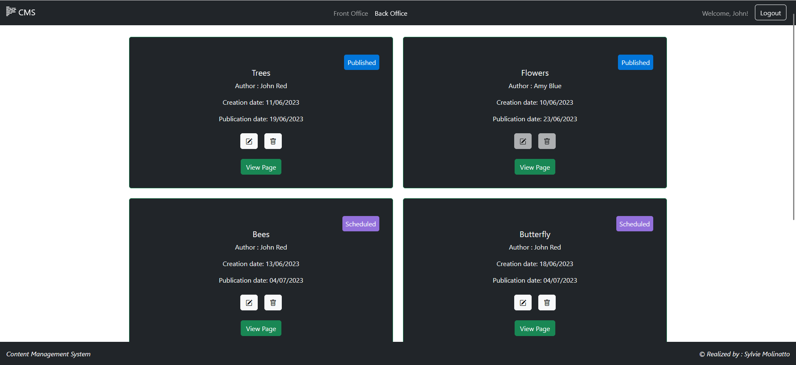
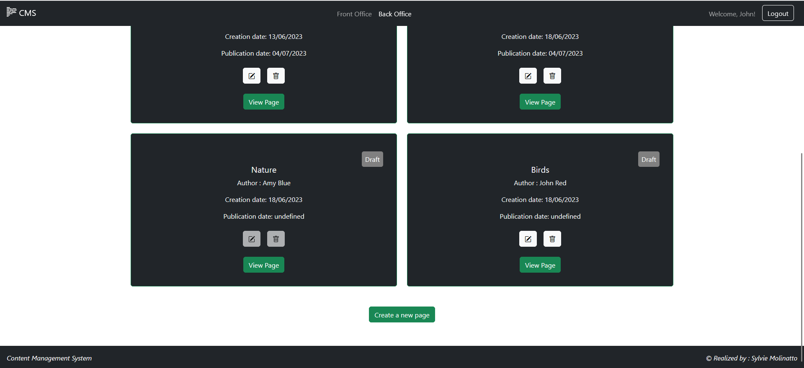
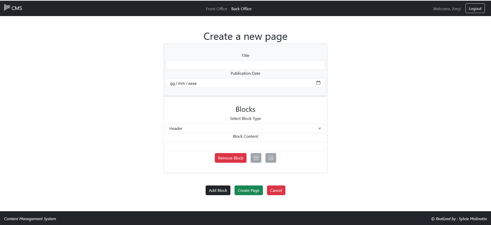

[](https://classroom.github.com/a/8AapHqUJ)
# Exam 1: "CMSmall"
## Student: s318952 Molinatto Sylvie

## React Client Application Routes

- Route `/`: display the list of published pages (front-office)
- Route `pages/:id`: display properties of that page in the front-office
- Route `/login`: display a form to execute login
- Route `/backoffice`: display a list of all the created pages
- Route `/backoffice/pages/:id`: display the properties of the page identified by 'id' in the back-office
- Route `/backoffice/create`: display a form to create a new page
- Route `/backoffice/edit/:pageid`: display a form to modify page properties
- Route `*`: route for pages not defined

## API Server

- GET `/api/sessions/current`
  - request parameters: credentials for passport authentication
  - response body: user info
  - response status: 200 success, 401 not authenticated

- POST `/api/sessions`
  - request parameters: credentials for passport authentication, content-type application/json
  - request body: credentials
  - response body: user info
  - response status: 201 successfull login, 401 wrong credentials

- DELETE `/api/sessions/current`
  - request parameters:  credentials for passport authentication
  - response body: none
  - response status: 200 successfull logout


- GET `/api/pages`
  - request parameters and request body content:  ```none```
  - response body content:
  ```
  [
    {
      "pageid": 1,
      "title": "Flowers",
      "author": 2,
      "creationDate": "2023-06-10",
      "publicationDate": "2023-06-23"
    },
    {
      "pageid": 2,
      "title": "Trees",
      "author": 1,
      "creationDate": "2023-06-11",
      "publicationDate": "2023-06-19"
    },
    {
      "pageid": 3,
      "title": "Bees",
      "author": 1,
      "creationDate": "2023-06-13",
      "publicationDate": "2023-07-04"
    },
    {
      "pageid": 4,
      "title": "Butterfly",
      "author": 1,
      "creationDate": "2023-06-18",
      "publicationDate": "2023-07-04"
    },
    {
      "pageid": 5,
      "title": "Nature",
      "author": 2,
      "creationDate": "2023-06-18",
      "publicationDate": ""
    },
    {
      "pageid": 6,
      "title": "Birds",
      "author": 1,
      "creationDate": "2023-06-18",
      "publicationDate": ""
    }
  ]
  ```

 GET `/api/publishedPages`
  - request parameters and request body content:  ```none```
  - response body content:
  ```
  [
    {
      "pageid": 1,
      "title": "Flowers",
      "author": 2,
      "creationDate": "2023-06-10",
      "publicationDate": "2023-06-23"
    },
    {
      "pageid": 2,
      "title": "Trees",
      "author": 1,
      "creationDate": "2023-06-11",
      "publicationDate": "2023-06-19"
    }
  ]
  ```

- GET `/api/pages/:id`
  - request parameters: pageid
  - request body content:  ```none```
  - response body content:
  ```
  {
    "pageid": 1,
    "title": "Flowers",
    "author": 1,
    "creationDate": "2023-06-10",
    "publicationDate": "2023-06-23"
  }
  ```

- GET `/api/pages/:id/blocks`
  - request parameters : pageid
  - request body content:  ```none```
  - response body content:
  ```
  [
    {
      "pageid": 3,
      "blockid": 7,
      "type": "header",
      "content": "Bees",
      "position": 1
    },
    {
      "pageid": 3,
      "blockid": 8,
      "type": "image",
      "content": "bee.jpg",
      "position": 2
    }
  ]
  ```

- GET `/api/pages/:pageid/blocks/:blockid`
  - request parameters : pageid, blockid
  - request body content:  ```none```
  - response body content:
  ```
  {
    "pageid": 1,
    "blockid": 1,
    "type": "header",
    "content": "Flowers: a bit of history",
    "position": 1
  }
  ```

- GET `/api/users/:id`
  - request parameters: user id
  - request body content:  ```none```
  - response body content:
  ```
  {
    "id": 1,
    "email": "John.Red@gmail.com",
    "name": "John",
    "surname": "Red",
    "role": "User"
  }
  ```

- GET `/api/website-name`
  - request parameters and request body content: ```none```
  - response body content:
  ```
  {
    "name": "CMS"
  }
  ```

- POST `/api/pages`
  - request parameters: ```none```
  - request body content:
  ```
  {
    "title": "Bees",
    "author": 1,
    "creationDate": "2023-06-13",
    "publicationDate": "2023-06-18"
  }
  ```
  - response body content:
  ```
  {
    "pageid": 5,
    "title": "Bees",
    "author": 1,
    "creationDate": "2023-06-13",
    "publicationDate": "2023-06-18"
  }
  ```

- POST `/api/pages/:id/blocks`
  - request parameters: pageid
  - request body content:
  ```
  {
    "type": "image",
    "content": "bee.jpg",
    "position": 1
  }
  ```
  - response body content:
  ```
  {
    "pageid": 3,
    "blockid": 12,
    "type": "image",
    "content": "bee.jpg",
    "position": 1
  }
  ```

- POST `/api/pages/:pageid/blocks/blockid`
  - request parameters: pageid, blockid
  - request body content:
  ```
  {
    "pageid": 4,
    "blockid": 8,
    "content": "Butterfly - image",
    "position": 1
  }
  ```
  - response body content:
  ```
  {
    "pageid": 4,
    "blockid": 8,
    "content": "Butterfly - image",
    "position": 1
  }
  ```

- PUT `/api/pages/:id`
  - request parameters: pageid
  - request body content:
  ```
  {
    "pageid": 4,
    "title": "Butterfly",
    "author": 1,
    "creationDate": "2023-06-14",
    "publicationDate": "2023-06-14"
  }
  ```
  - response body content:
  ```
  {
    "pageid": 4,
    "title": "Butterfly",
    "author": 2,
    "creationDate": "2023-06-15",
    "publicationDate": "2023-06-14"
  }
  ```

- DELETE `/api/pages/:id/blocks`
  - request parameters: pageid
  - request body content:  ```none```
  - response body content:  ```none```

- DELETE `/api/pages/:pageid/blocks/:blockid`
  - request parameters: pageid, blockid
  - request body content:  ```none```
  - response body content:  ```none```

- DELETE `/api/pages/:id`
  - request parameters: pageid
  - request body content:  ```none```
  - response body content:  ```none```

- GET `/api/users`
  - request parameters: ```none```
  - request body content:  ```none```
  - response body content:  
  
  ``` 
  [
    {
      "id": 1,
      "email": "John.Red@gmail.com",
      "name": "John",
      "surname": "Red",
      "role": "User"
    },
    {
      "id": 2,
      "email": "Amy.Blue@gmail.com",
      "name": "Amy",
      "surname": "Blue",
      "role": "User"
    },
    {
      "id": 3,
      "email": "Joe.White@gmail.com",
      "name": "Joe",
      "surname": "White",
      "role": "User"
    },
    {
      "id": 4,
      "email": "Rachel.Gray@gmail.com",
      "name": "Rachel",
      "surname": "Gray",
      "role": "Admin"
    }
  ]
  ```

- PUT `/api/website-name`
  - request parameters: ```none```
  - request body content:
  ```
  {
    "name": "Content Management System"
  }
  ```
  - response body content
  ```
  {
    "name": "Content Management System"
  }
  ```

## Database Tables

- Table `users` - contains:  `id(PK), email, name, surname, hashedPassword, salt, role `  
- Table `pages` - contains:  `pageid(PK), title, author(FK), creationDate, publicationDate `
- Table `blocks` - contains: `pageid(FK), blockid(PK), type(header, paragraph or image), content,  position  `
- Table `website-name` - contains:  `id(PK), name `

## Main React Components

- `AuthComponent` (in `AuthComponent.jsx`): component that displays the page with the form to authenticate each user.
- `Footer` (in `Footer.jsx`): component that displays a small footer.
- `Navigation` (in `Navigation.jsx`): contains the navigation bar for each page of the application. In the navbar it's displayed the website name and the login/logout button. 
- `PageForm` (in `PageForm.jsx`): consists in the form to create or update a page in the backoffice.
- `PageLayout` (in `PageLayout.jsx`): contains all the possible layout, in particular:
    - `FrontOfficeLayout` : layout rendered for all unauthenticated and authenticated users with all the published pages
    - `PageDetailsLayout`: layout rendered to see all the properties of a page
    - `BackOfficeLayout`: layout rendered only for authenticated users with all pages
    - `NewPageLayout`: layout rendered to create a new page
    - `EditPageLayout`: layout rendered to modify the properties of a page
    - `NotFoundLayout`: layout rendered when visiting a not defined url
    - `NotLoggedLayout`: layout rendered when trying to access to the backoffice without authentication
    - `ForbiddenLayout`: layout rendered when trying to edit a page without autenthication
    - `LoginLayout`: layout rendered for authenticating users
    - `LoadingLayout`: layout rendered while waiting for the server response
- `PageLibrary` (in `PageLibrary.jsx`): contains the specific elements to display the pages in front-office and back-office.

## Screenshot





## Users Credentials

- John.Red@gmail.com, password: password, role: User
- Amy.Blue@gmail.com, password: password, role: User
- Joe.White@gmail.com, password: password, role: User
- Rachel.Gray@gmail.com, password: password, role: Admin
