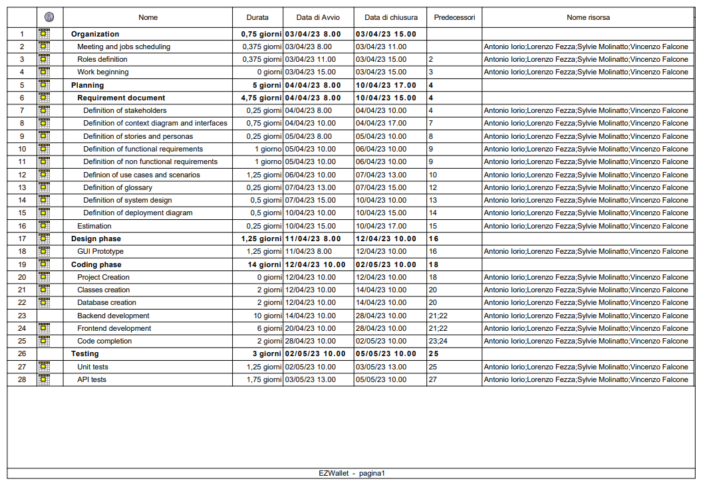
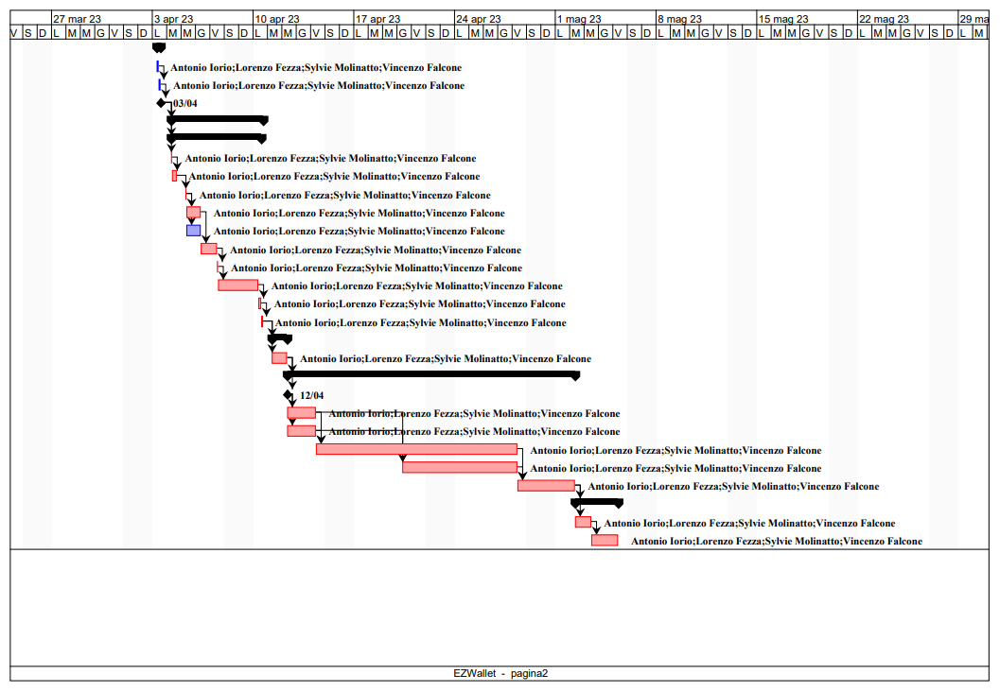

# Project Estimation - CURRENT
Date: 18/04/2023

Version: 1

# Estimation approach
Consider the EZWallet  project in CURRENT version (as received by the teachers), assume that you are going to develop the project INDEPENDENT of the deadlines of the course
# Estimate by size
### 
|                                                    | Estimate                        |             
| -------------------------------------------------- | ------------------------------- |  
| NC =  Estimated number of classes to be developed  | 30                              |             
| A = Estimated average size per class, in LOC       | 150                             | 
| S = Estimated size of project, in LOC (= NC * A)   | 4500                            |
| E = Estimated effort, in person hours (here use productivity 10 LOC per person hour) | 450      |   
| C = Estimated cost, in euro (here use 1 person hour cost = 30 euro) | 13500          | 
| Estimated calendar time, in calendar weeks (Assume team of 4 people, 8 hours per day, 5 days per week )                                               | 2 calendar weeks (14 working days)                         |               

# Estimate by product decomposition
### 
|         component name    | Estimated effort (person hours)   |             
| -----------               | -------------------------------   | 
| requirement document      |  112                              |
| GUI prototype             |  80                               |
| design document           |  80                               |
| code                      |  240                              |
| unit tests                |  88                               |
| api tests                 |  56                               |
| management documents      |  40                               |
| TOTAL                     |  696                              |

# Estimate by activity decomposition
### 
|         Activity name    | Estimated effort (person hours)   |             
| ------------------------ | --------------------------------- | 
| Organization             | 24                                |
| Planning :               |                                   |
|  - Requirement document  | 152                               |
|  - Estimation            | 8                                 |
| Design phase:            |                                   |
|  - GUI prototype         | 40                                |
| Coding phase             | 450                               |
| Testing                  | 96                                |
| TOTAL                    | 770                               |

###

# Summary
|                                       | Estimated effort   | Estimated duration |          
| ----------------------                | ------------------ | ------------------ |
| estimate by size                      | 450                |  2 weeks (14 working days)          |
| estimate by product decomposition     | 696                |  5 weeks (22 working days)          |
| estimate by activity decomposition    | 770                |  5 weeks (24 working days)                  |

The main reason for the differences between the above three methodologies is the level of detail. Estimates by product and activity decomposition increase the level of detail in respect of to the estimate by size and this fact determines an increase in the reliability of the result. On the other hand, with the by size estimation , being the level of detail lower, there is the tendency to underestimate the effort.

