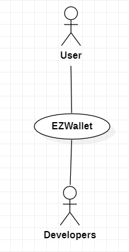
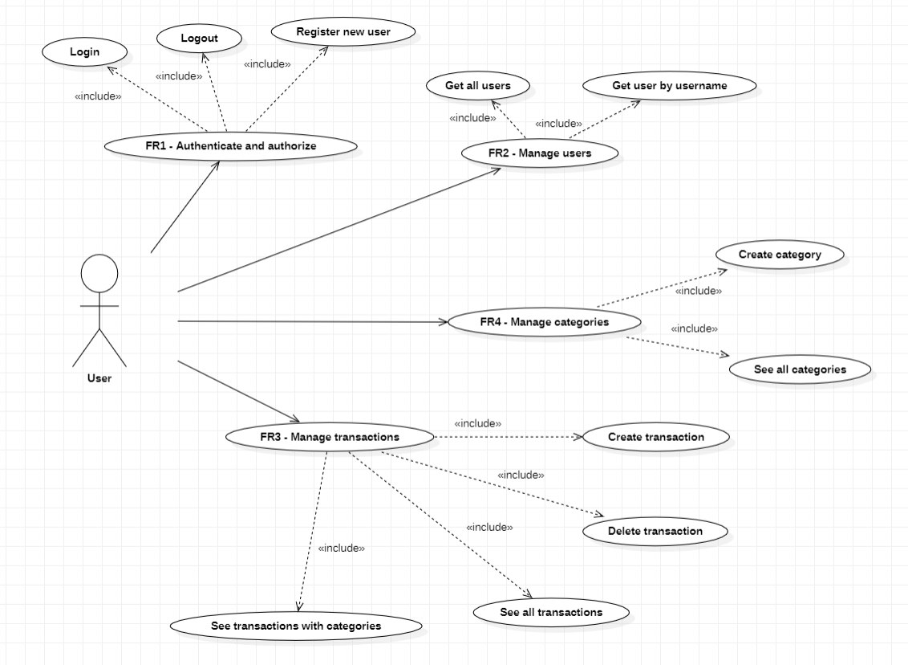
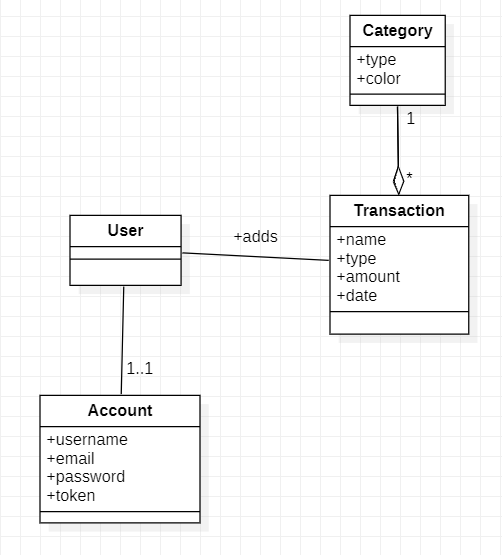
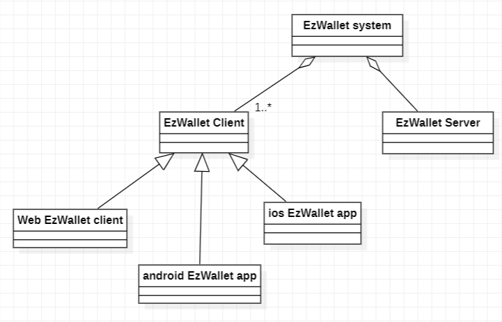
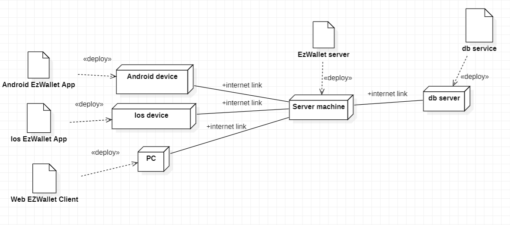

# Requirements Document - current EZWallet

Date: 17/04/2023

Version: V1 - description of EZWallet in CURRENT form (as received by teachers)

 
| Version number | Change       |
| ---------------|:-----------  |
| 1              | First version| 

# Contents

- [Informal description](#informal-description)
- [Stakeholders](#stakeholders)
- [Context Diagram and interfaces](#context-diagram-and-interfaces)
	+ [Context Diagram](#context-diagram)
	+ [Interfaces](#interfaces) 
	
- [Stories and personas](#stories-and-personas)
- [Functional and non functional requirements](#functional-and-non-functional-requirements)
	+ [Functional Requirements](#functional-requirements)
	+ [Non functional requirements](#non-functional-requirements)
- [Use case diagram and use cases](#use-case-diagram-and-use-cases)
	+ [Use case diagram](#use-case-diagram)
	+ [Use cases](#use-cases)
    	+ [Relevant scenarios](#relevant-scenarios)
- [Glossary](#glossary)
- [System design](#system-design)
- [Deployment diagram](#deployment-diagram)

# Informal description
EZWallet (read EaSy Wallet) is a software application designed to help individuals and families keep track of their expenses. Users can enter and categorize their expenses, allowing them to quickly see where their money is going. EZWallet is a powerful tool for those looking to take control of their finances and make informed decisions about their spending.

# Stakeholders

| Stakeholder name  | Description | 
| ----------------- |:-----------:|
|  User             |  Uses the application to keep track of his finances| 
|  Startup company: | Composed by Administrator, COO and developers         |
| &nbsp;&nbsp;&nbsp;&nbsp;&nbsp;&nbsp;- Developers              |  They create and develop the code for the application, solve problems and test requirements the app should satisfy                        |
| Google Play Store and Apple Store| Official app stores for digital distribution services that allow to download apps for certified devices running on the different operating systems.|

# Context Diagram and interfaces

## Context Diagram

## Interfaces

| Actor | Logical Interface | Physical Interface  |
| ------------- |:-------------:| :-----:|
| User          |  App (GUI) - to be defined           | Smartphone (display, touch screen) |
| Developers    |  App (GUI) - to be defined           | PC (display, touch screen and keyboard) |

# Stories and personas
Patrick and Meredith are two employees with three children who attend middle school. Having significant expenses to bear to raise their children, they believe that it may be useful to monitor their income and cash outflows so as to limit unnecessary expenses and ensure the best lifestyle for their children. Since they discovered the existence of EZWallet, the management of their finances has become much easier and more efficient, since they no longer have to write down all the expenses without having a general view.

Michael is a young boy with the dream of living alone. As he tends to be spendthrift, he would like to be able to keep track of his expenses so as to save money by limiting unnecessary expenses to the maximum and realize his dream. With the ability to categorize expenses, offered by the EZWallet application, now he can finally view in real time the types of outputs on which he could save money.

# Functional and non functional requirements

## Functional Requirements

| ID                                     | Description  |
| ---------------------------------------|:-------------------------------------------------------------:| 
| FR1                                    |  Authenticate and authorize users                             |
| &nbsp;&nbsp;&nbsp;&nbsp;&nbsp; FR1.1   |  Register a new user                                          |
| &nbsp;&nbsp;&nbsp;&nbsp;&nbsp; FR1.2   |  Login                                                        |
| &nbsp;&nbsp;&nbsp;&nbsp;&nbsp; FR1.3   |  Logout                                                       |
| FR2                                    |  Manage users                                                 | 
| &nbsp;&nbsp;&nbsp;&nbsp;&nbsp; FR2.1   |  Get all the users                                            |
| &nbsp;&nbsp;&nbsp;&nbsp;&nbsp; FR2.2   |  Get user by username                                         |
| FR3                                    |  Manage transactions                                          |
| &nbsp;&nbsp;&nbsp;&nbsp;&nbsp; FR3.1   |  Create a new transaction                                     |
| &nbsp;&nbsp;&nbsp;&nbsp;&nbsp; FR3.2   |  See all transactions                                         |
| &nbsp;&nbsp;&nbsp;&nbsp;&nbsp; FR3.3   |  See all transactions with categories                         |
| &nbsp;&nbsp;&nbsp;&nbsp;&nbsp; FR3.4   |  Delete a transaction                                         |
| FR4                                    |  Manage categories                                            |
| &nbsp;&nbsp;&nbsp;&nbsp;&nbsp; FR4.1   |  Create a new category of transactions                        |
| &nbsp;&nbsp;&nbsp;&nbsp;&nbsp; FR4.2   |  See all the categories                                       |

## Non Functional Requirements

| ID        | Type (efficiency, reliability, ..)           | Description  | Refers to |
| ----------|:-----------------:| :----------------------------------------------:| -----:|
|  NFR1     |  Efficiency       | App functions should complete in < 0,5 sec      | All FR |
|  NFR2     |  Portability      | App should be used on every mobile OS (Android, iOS, ...)| All FR |
|  NFR3     |  Availability     | Max server downtime : 5h/year  | All FR  |
|  NFR4     |  Efficiency       | Memory: Ram < 0.150 Gbyte		|  All FR |
|  NFR5     |  Maintainability  | Space of the database must be large enough  | All FR | 

# Use case diagram and use cases

## Use case diagram

### Use case 1, UC1 - Registration
| Actors Involved     | User                                                                                    |
| ------------------- |:---------------------------------------------------------------------------------------:| 
| Precondition        | The user has no account                                                                 |
| Post condition      | The user has a new account                                                              |
| Nominal Scenario    | The user creates a new account by entering username, email and password                 |
| Variants            | User already registered (email exists) -> error message                                 |
| Exceptions          | No Internet connection                                                                  |

#### Scenario 1.1 
| Scenario 1.1     |                                                                                    |
| ---------------- |:----------------------------------------------------------------------------------:| 
| Precondition     | The user has no account                                                            |
| Post condition   | The user has a new account                                                         |
| Step#            | Description                                                                        |
|  1               | The user requests to register a new account by sending a *post* request with username, email and password |  
|  2               | System checks if the email is already registered                                   |
 | 3               | If email still doesn't exists, system notifies the correct execution of the registration procedure |

#### Scenario 1.2
| Scenario 1.2  |                                                                                                     |
| ---------------- |:---------------------------------------------------------------------------------------------------------:| 
| Precondition     | The user has no account                                                                                   |
| Post condition   | The user fails the registration                                                                           |
| Step#            | Description                                                                                               |
|  1               | The user requests to register a new account by sending a *post* request with username, email and password |  
|  2               | System checks if the email is already registered                                                          |
|  3               | If email already exists, system notifies it and the registration procedure fails                          |

### Use case 2, UC2 - Login
| Actors Involved  | User                                                                                                  |
| ---------------- |:-----------------------------------------------------------------------------------------------------:| 
| Precondition     | The user must have an account                                                                         |
| Post condition   | The user is successfully logged                                                                       |
| Nominal Scenario | The user inserts correct e-mail and password for login and he's successfully authenticated            |
| Variants         | The user is already logged in, the user types a wrong e-mail and/or password, the email doesn't exist |
| Exceptions       | No Internet connection                                                                                |

##### Scenario 2.1 
| Scenario 2.1     |                                                                                             |
| ---------------- |:-------------------------------------------------------------------------------------------:| 
| Precondition     | The user must have an account                                                               |
| Post condition   | The user is successfully logged                                                             |
| Step#            | Description                                                                                 |
|  1               | The user requests to log in by sending a *post* request with email and password             |  
|  2               | System checks if the user is not already logged, if email exists and if password is correct |
|  3               | If there are no erros the user is successfully logged                                       |

##### Scenario 2.2 
| Scenario 2.2    |                                                                                            |
| --------------- |:------------------------------------------------------------------------------------------:| 
| Precondition    | The user must have an account                                                              |
| Post condition  | The user fails the login procedure                                                         |
| Step#           | Description                                                                                |
|  1              | The user requests to log in by sending a *post* request with email and password            |  
|  2              | System checks if the user is not already logged, if email exists and if password is correct|
|  3              | The user is already logged and the system notifies it                                      |
|  4              | The user fails the login procedure and restart from STEP 1                                 |

##### Scenario 2.3 
| Scenario 2.3    |                                                                                            |
| --------------- |:------------------------------------------------------------------------------------------:| 
| Precondition    | The user must have an account                                                              |
| Post condition  | The user fails the login procedure                                                         |
| Step#           | Description                                                                                |
|  1              | The user requests to log in by sending a *post* request with email and password            |  
|  2              | System checks if the user is not already logged, if email exists and if password is correct|
|  3              | The email inserted doesn't exist and the system notifies it                               |
|  4              | The user fails the login procedure and restart from STEP 1                                |

##### Scenario 2.4 
| Scenario 2.4    |                                                                                            |
| --------------- |:------------------------------------------------------------------------------------------:| 
| Precondition    | The user must have an account                                                              |
| Post condition  | The user fails the login procedure                                                         |
| Step#           | Description                                                                                |
|  1              | The user requests to log in by sending a *post* request with email and password            |  
|  2              | System checks if the user is not already logged, if email exists and if password is correct|
|  3              | The password inserted is not correct and the system notifies it                            |
|  4              | The user fails the login procedure and restart from STEP 1                                 |

### Use case 3, UC3 - Logout
| Actors Involved  | User                                                               |
| ---------------- |:------------------------------------------------------------------:| 
| Precondition     | The user must have an account and be logged in                     |
| Post condition   | The user is successfully logged out                                |
| Nominal Scenario | The user is logged in and requests to log out from the application |
| Variants         | The user is not logged in                                          |
| Exceptions       | No Internet connection                                             |

##### Scenario 3.1 
| Scenario 3.1    |                                                |
| --------------- |:----------------------------------------------:| 
| Precondition    | The user must have an account and be logged in |
| Post condition  | The user is successfully logged out            |
| Step#           | Description                                    |                                
|  1              | The user requests to log out                   |  
|  2              | System checks if user is logged in             |
|  2              | The user is successfully logged out            |

##### Scenario 3.2
| Scenario 3.2    |                                                      |
| --------------- |:----------------------------------------------------:| 
| Precondition    | The user must have an account and be logged in       |
| Post condition  | The logout procedure fails                           |
| Step#           | Description                                          |                                
|  1              | The user requests to log out                         |  
|  2              | System checks if user is logged in                   |
|  2              | User is not logged in so the logout procedure fails  |

### Use case 4, UC4 - Get all users
| Actors Involved     | User                                                                            |
| ------------------- |:-------------------------------------------------------------------------------:|
| Precondition        | None                                                                            |
| Post condition      | List of all registered users                                                    |
| Nominal Scenario    | User requests from the database the list of all users registered on the system  |
| Variants            | None                                                                            |
| Exceptions          | No Internet connection												            |

##### Scenario 4.1
| Scenario 4.1        |                                                            |
| ------------------- |:----------------------------------------------------------:| 
| Precondition        | None                                                       |
| Post condition      | List of all registered users                               |
| Step#               | Description                                                |
|  1                  | User makes a *get* request on "*getUsers*"                 |
|  2                  | System retrieves and shows all users with their attributes |

### Use case 5, UC5 - Get user by username
| Actors Involved     | User                                                                               |
| ------------------- |:----------------------------------------------------------------------------------:|
| Precondition        | The user must have an account and be logged in                                     |
| Post condition      | User obtains information on his own profile                                        |
| Nominal Scenario    | User asks informations about his profile giving the username as a parameter        |
| Variants            | The user is not logged in, the username doesn't exists, the username is not correct|
| Exceptions          | No Internet connection                                                             |

##### Scenario 5.1
| Scenario  5.1       |                                                                       |
| ------------------- |:---------------------------------------------------------------------:| 
| Precondition        | The user must have an account and be logged in                        |
| Post condition      | User gets information on his profile                                  |
| Step#               | Description                                                           |
|  1                  | User makes a *get* request with his username                          |
|  2                  | System checks if user is logged, if username exists and if the username is of the logged user|
|  3                  | If username is correct, profile information are retrieved             |

### Use case 6, UC6 - Create a new transaction
| Actors Involved   | User                                                              |
| ----------------- |:-----------------------------------------------------------------:| 
| Precondition      | User is logged                                                    |
| Post condition    | New transaction created                                           |
| Nominal Scenario  | User enters correct name, amount and type for the new transaction |
| Variants          | User is not logged in -> error message                            |
| Exceptions        | No Internet connection                                            |

#### Scenario 6.1 
| Scenario 6.1      |                                                          |
| ----------------- |:--------------------------------------------------------:| 
| Precondition      | User is logged                                           |
| Post condition    | New transaction created                                  |
| Step#             | Description                                              |
|  1                | User asks for adding a new transaction with a *post* request with name, amount and type of the new transaction |  
|  2                | System checks if user is logged, new transaction created |

### Use case 7, UC7 - See all transactions
| Actors Involved       | User                                                         |
| --------------------- |:------------------------------------------------------------:|
|  Precondition         | User is logged                                               |
|  Post condition       | User gets a list with all transactions                       |
|  Nominal Scenario     | User makes a transaction *get* request                       |
|  Variants             | User is not logged in                                        |
|  Exceptions           | No Internet connection                                       |

##### Scenario 7.1
| Scenario 7.1         |                                                                             |
| -------------------- |:---------------------------------------------------------------------------:| 
| Precondition         | User is logged                                                              |
| Post condition       | All transactions are listed                                                 |
| Step#                | Description                                                                 |
|  1                   | User makes a transaction *get* request                                      |
|  2                   | System checks if user is logged, all transactions are listed to the user    |

### Use case 8, UC8 -  See all transactions related to their respective categories
| Actors Involved      | User                                                                       |
| -------------------- |:--------------------------------------------------------------------------:|
| Precondition         | User is logged                                                             |
| Post condition       | User gets list of all transactions with their respective category type  |
| Nominal Scenario     | User makes a label *get* request                                           |
| Variants             | User is not logged                                                         |
| Exceptions           | No internet connection                                                     |

##### Scenario 8.1
| Scenario  8.1      |                                                                                                 |
| ------------------ |:-----------------------------------------------------------------------------------------------:| 
| Precondition       | User is logged                                                                                  |
| Post condition     | All transactions with category type are listed                                                  |
| Step#              | Description                                                                                     |
|  1                 | User makes a label *get* request                                                                |
|  2                 | System checks if user is logged and lists all transactions with their respective category type  |

### Use case 9, UC9 - Delete a transaction
| Actors Involved   | User                                         |
| ----------------- |:--------------------------------------------:| 
| Precondition      | User is logged                               |
| Post condition    | Transaction deleted                          |
| Nominal Scenario  | User enters a valid transaction id to delete |
| Variants          | User is not logged -> error message          |
| Exceptions        | No Internet connection                       |

#### Scenario 9.1 
| Scenario 9.1      |                                                                                            |
| ----------------- |:------------------------------------------------------------------------------------------:| 
| Precondition      | User is logged                                                                             |
| Post condition    | Transaction deleted                                                                        |
| Step#             | Description                                                                                |
|  1                | User asks for deleting a transaction by sending a *delete* request with the transaction id |  
|  2                | System checks if user is logged, the transaction is deleted                                |

### Use case 10, UC10 - Create a new category of transactions
| Actors Involved    | User                        |
| ------------------ |:---------------------------:| 
| Precondition       | User is logged              |
| Post condition     | A new category is created   |
| Nominal Scenario   | User creates a new category |
| Variants           | User is not logged          |
| Exceptions         | No Internet connection      |

#### Scenario 10.1 
| Scenario 10.1     |                                                                          |
| ----------------- |:------------------------------------------------------------------------:| 
| Precondition      | User is logged                                                           |
| Post condition    | New category created                                                     |
| Step#             | Description                                                              |
|  1                | User asks for adding a new category with a *post* request with a type and a color for the new category |
|  2                | System checks if user is logged, new category created                    |

### Use case 11, UC11 -  See all categories
| Actors Involved       | User                                |
| --------------------- |:-----------------------------------:|
| Precondition          | User is logged                      |
| Post condition        | User gets list of all categories    |
| Nominal Scenario      | User makes a category *get* request |
| Variants              | User is not logged                  |
| Exceptions            | No internet connection              |

##### Scenario 11.1

| Scenario  11.1     |                                                                           |
| ------------------ |:-------------------------------------------------------------------------:| 
| Precondition       | User is logged                                                            |
| Post condition     | All categories are listed                                                 |
| Step#              | Description                                                               |
|  1                 | User makes a category *get* request                                       |
|  2                 | System checks if user is logged, all categories are listed to the user    |

# Glossary
 

# System Design

# Deployment Diagram 

# Defects table

| Defect Number | Method               | Description |
| ------------- |:--------------------:|:-----------:|
| 1             | getUsers()           | The method does not require neither authentication nor administrative privileges and this leads to security and privacy problems |
| 2             | getUserByUsername()  | The method just shows the informations about the account logged, maybe it could be better to rename it in a more comprehensive way |
| 3             | get_labels()          | The method should return the transactions of an account with their respective categories but the color attribute is never shown and, as a consequence, the method returns the same content of getTransactions()
| 4             | create_Categories()  | The method allows to create and store the same category (same type and color) many times |
| 5             | get_transaction()    | The transactions are not associated to a specific account so this method returns all transactions locally stored (not necessarily belonging to the same account) and this leads to privacy and security problems |
