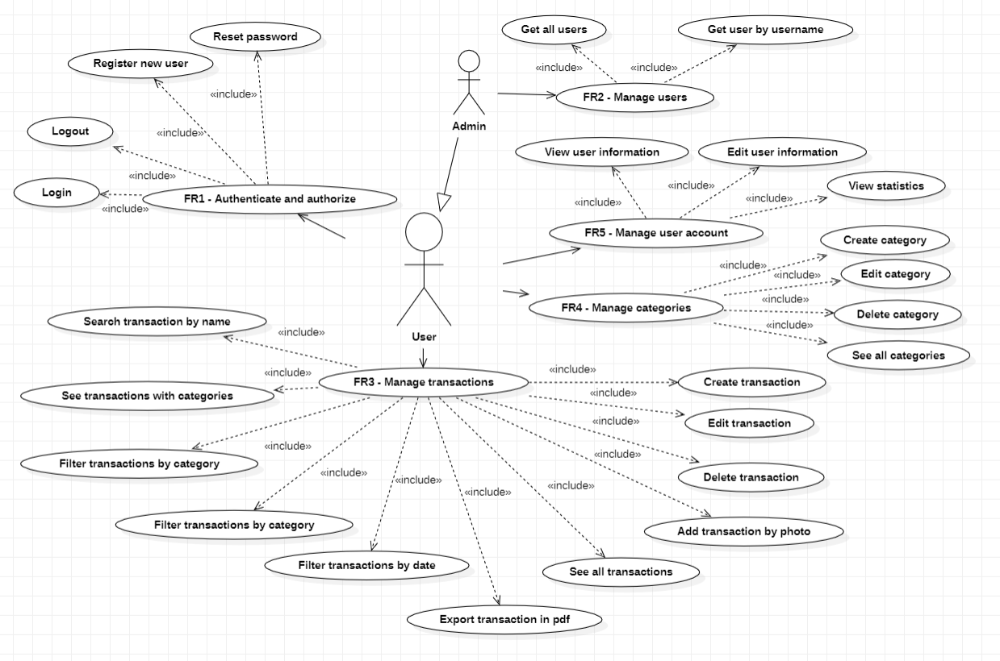
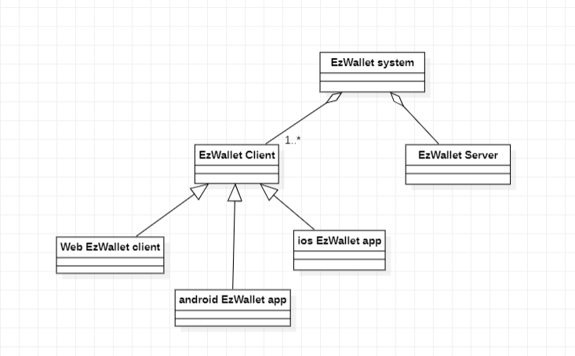
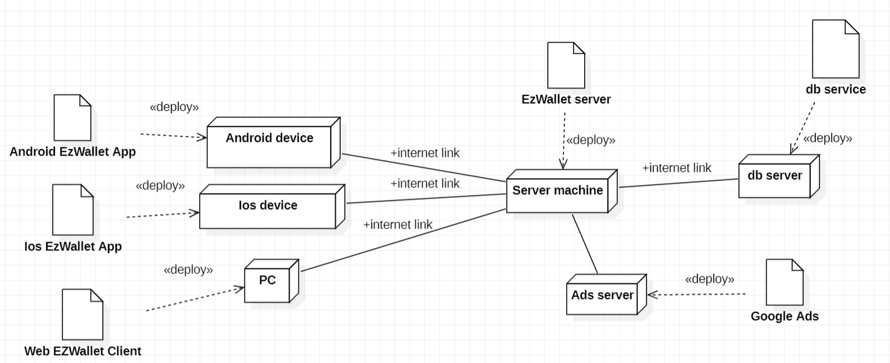

# Requirements Document - future EZWallet

Date: 20/04/2023

Version: V2 - description of EZWallet in FUTURE form (as proposed by the team)

 
| Version number | Change         |
| -------------- |:---------------|
| 2              | Second version | 

# Contents

- [Informal description](#informal-description)
- [Stakeholders](#stakeholders)
- [Context Diagram and interfaces](#context-diagram-and-interfaces)
	+ [Context Diagram](#context-diagram)
	+ [Interfaces](#interfaces) 
	
- [Stories and personas](#stories-and-personas)
- [Functional and non functional requirements](#functional-and-non-functional-requirements)
	+ [Functional Requirements](#functional-requirements)
	+ [Non functional requirements](#non-functional-requirements)
- [Use case diagram and use cases](#use-case-diagram-and-use-cases)
	+ [Use case diagram](#use-case-diagram)
	+ [Use cases](#use-cases)
    	+ [Relevant scenarios](#relevant-scenarios)
- [Glossary](#glossary)
- [System design](#system-design)
- [Deployment diagram](#deployment-diagram)

# Informal description
EZWallet (read EaSy Wallet) is a software application designed to help individuals and families keep track of their expenses. Users can enter and categorize their expenses, allowing them to quickly see where their money is going. EZWallet is a powerful tool for those looking to take control of their finances and make informed decisions about their spending.

# Stakeholders

| Stakeholder name  | Description | 
| ----------------- |:-----------:|
|  User             |  Uses the application to keep track of his finances| 
|  Startup company: | Composed by Administrator, COO and developers         |
| &nbsp;&nbsp;&nbsp;&nbsp;&nbsp;&nbsp;- Administrator           | Has the role of managing the company in all aspects                        |
| &nbsp;&nbsp;&nbsp;&nbsp;&nbsp;&nbsp;- Chief Operative Officer | Has the role of overseeing all developers operations and ensures that the team works toward achieving the business goals                      |
| &nbsp;&nbsp;&nbsp;&nbsp;&nbsp;&nbsp;- Developers              | They create and develop the code for the application, solve problems and test requirements the app should satisfy                        |
| &nbsp;&nbsp;&nbsp;&nbsp;&nbsp;&nbsp;- Software manager		| A person inside the company who manages the software |
| Google Play Store and Apple Store| Official app stores for digital distribution services that allow to download apps for certified devices running on the different operating systems.|
| Google ads	|	Online marketing platform for publishing ads within the Google search engine |

# Context Diagram and interfaces

## Context Diagram

## Interfaces
| Actor         | Logical Interface                    | Physical Interface                                     |
| ------------- |:------------------------------------:| :-----------------------------------------------------:|
| User          |  App (GUI) - to be defined           | Smartphone (display, touch screen)                     |
| Administrator |  App (GUI) - to be defined           | PC (display, touch screen and keyboard)                |
| COO           |  App (GUI) - to be defined           | PC (display, touch screen and keyboard)                |
| Developers    |  App (GUI) - to be defined           | PC (display, touch screen and keyboard)                |
| Software manager | App (GUI) - to be defined		   | PC (display, touch screen and keyboard)                |	
| Google ads	|  Internet link					   | https://developers.google.com/google-ads/api/docs/start|

# Stories and personas
Patrick and Meredith are two employees with three children who attend middle school. Having significant expenses to bear to raise their children, they believe that it may be useful to monitor their income and cash outflows so as to limit unnecessary expenses and ensure the best lifestyle for their children. Since they discovered the existence of EZWallet, the management of their finances has become much easier and more efficient, since they no longer have to write down all the expenses without having a general view.

Michael is a young boy with the dream of living alone. As he tends to be spendthrift, he would like to be able to keep track of his expenses so as to save money by limiting unnecessary expenses to the maximum and realize his dream. With the ability to categorize expenses, offered by the EZWallet application, now he can finally view in real time the types of outputs on which he could save money.

# Functional and non functional requirements

## Functional Requirements

| ID                                     | Description                       |
| -------------------------------------- |:---------------------------------:| 
| FR1                                    |  Authenticate and authorize users |
| &nbsp;&nbsp;&nbsp;&nbsp;&nbsp; FR1.1   |  Register a new user   			 |
| &nbsp;&nbsp;&nbsp;&nbsp;&nbsp; FR1.2   |  Login                 			 |
| &nbsp;&nbsp;&nbsp;&nbsp;&nbsp; FR1.3   |  Logout                			 |
| &nbsp;&nbsp;&nbsp;&nbsp;&nbsp; FR1.4   |  Reset password        			 |
| FR2                                    |  Manage users          			 | 
| &nbsp;&nbsp;&nbsp;&nbsp;&nbsp; FR2.1   |  Get all the users     			 |
| &nbsp;&nbsp;&nbsp;&nbsp;&nbsp; FR2.2   |  Get user by username            |
| FR3                                    |  Manage transactions              |
| &nbsp;&nbsp;&nbsp;&nbsp;&nbsp; FR3.1   |  Create a new transaction         |
| &nbsp;&nbsp;&nbsp;&nbsp;&nbsp;&nbsp;&nbsp;&nbsp;&nbsp;&nbsp; FR3.1.1 |  Add transaction by photo |
| &nbsp;&nbsp;&nbsp;&nbsp;&nbsp; FR3.2   |  See all transactions             |
| &nbsp;&nbsp;&nbsp;&nbsp;&nbsp;&nbsp;&nbsp;&nbsp;&nbsp;&nbsp; FR3.2.1 | See all transactions related to their respective categories | 
| &nbsp;&nbsp;&nbsp;&nbsp;&nbsp;&nbsp;&nbsp;&nbsp;&nbsp;&nbsp; FR3.2.2 | Filter transactions by amount |
| &nbsp;&nbsp;&nbsp;&nbsp;&nbsp;&nbsp;&nbsp;&nbsp;&nbsp;&nbsp; FR3.2.3 | Filter transactions by date |
| &nbsp;&nbsp;&nbsp;&nbsp;&nbsp;&nbsp;&nbsp;&nbsp;&nbsp;&nbsp; FR3.2.4 | Filter transactions by category |
| &nbsp;&nbsp;&nbsp;&nbsp;&nbsp;&nbsp;&nbsp;&nbsp;&nbsp;&nbsp; FR3.2.5 | Search transaction by name 
| &nbsp;&nbsp;&nbsp;&nbsp;&nbsp; FR3.4   |  Delete a transaction             |
| &nbsp;&nbsp;&nbsp;&nbsp;&nbsp; FR3.5   |  Edit transaction                 |
| &nbsp;&nbsp;&nbsp;&nbsp;&nbsp; FR3.6   |  Export transactions              |	
|FR4 									 |  Manage categories 	             |
| &nbsp;&nbsp;&nbsp;&nbsp;&nbsp; FR4.1   |  Create a new category of transactions |
| &nbsp;&nbsp;&nbsp;&nbsp;&nbsp; FR4.2   |  See all the transactions categories   |
| &nbsp;&nbsp;&nbsp;&nbsp;&nbsp; FR4.3	 |  Edit category                    |
| &nbsp;&nbsp;&nbsp;&nbsp;&nbsp; FR4.4	 |  Delete category                  |
|FR5 									 |  Manage user account              |
| &nbsp;&nbsp;&nbsp;&nbsp;&nbsp; FR5.1   |  Delete account                   |
| &nbsp;&nbsp;&nbsp;&nbsp;&nbsp; FR5.2   |  View user information            |
| &nbsp;&nbsp;&nbsp;&nbsp;&nbsp; FR5.3   |  Edit user information            |
| &nbsp;&nbsp;&nbsp;&nbsp;&nbsp; FR5.4   |  View user statistics             |
|FR6                                     |  Manage ads                       |
| &nbsp;&nbsp;&nbsp;&nbsp;&nbsp; FR 6.1  |  Receive ad                       |
| &nbsp;&nbsp;&nbsp;&nbsp;&nbsp; FR 6.2  |  Show ad                          |

## Non Functional Requirements

| ID        | Type             | Description                                              | Refers to |
| --------- |:----------------:| :-------------------------------------------------------:| ---------:|
|  NFR1     | Usability        | App should be used with no training by any user          | All FR    |
|  NFR2     | Efficiency       | App functions should complete in < 0,5 sec               | All FR    |
|  NFR3     | Portability      | App should be used on every mobile OS (Android, iOS, ...)| All FR    |
|  NFR4     | Availability     | Max server downtime : 5h/year                            | All FR    |
|  NFR5     | Security         | App should guarantee access only to registered people and should show only account-related data| All FR |
|  NFR6     | Efficiency       | Memory: Ram < 0.150 Gbyte		                          | All FR    |
|  NFR7     | Robustness       | Time to restart after failure < 10 s                     | All FR    |
|  NFR8     | Privacy          | User information and sensitive data have to be protected | FR5       |
|  NFR9     | Maintainability  | Space of the database must be large enough               | All FR    | 

# Use case diagram and use cases

## Use case diagram

### Use case 1, UC1 - Registration

| Actors Involved     | User                                                                                    |
| ------------------- |:--------------------------------------------------------------------------------------: | 
| Precondition        | The user has no account                                                                 |
| Post condition      | The user has  a new account                                                             |
| Nominal Scenario    | The user creates a new account by entering username, email, password, full name, birth date, phone number, gender and country    |
| Variants            | User already registered (email exists), password does not satisfy rules -> error message|
| Exceptions          | No Internet connection                                                                  |

##### Scenario 1.1 

| Scenario 1.1        |                                                                                    |
| ------------------- |:----------------------------------------------------------------------------------:| 
| Precondition        | The user has no account                                                            |
| Post condition      | The user has new account                                                           |
| Step#               | Description                                                                        |
|  1                  | The user clicks a button to register a new account                                 |  
|  2                  | The user digits a correct username                                                 |
|  3	              | The user digits a correct email                                                    |
|  4	              | The password is evaluated (minimum 7 chars, at least a number and a special chars) |
|  5	              | The user clicks the button to confirm the registration                             |

##### Scenario 1.2

| Scenario 1.2        |                                                    |
| ------------------- |:--------------------------------------------------:|
| Precondition        | The user has no account                            |
| Post condition      | The user has new account                           |
| Step#               | Description                                        |
|  1	              | The user clicks a button to register a new account |
|  2	              | The user digits a correct username                 |
|  3	              | The user digits an incorrect email (already exists)|
|  4 	              | The user fails the registration                    |

##### Scenario 1.3

| Scenario 1.3        |                                                   |
| ------------------- |:-------------------------------------------------:|
| Precondition        | The user has no account                           |
| Post condition      | The user has new account                          |
| Step#               | Description                                       |
|  1	              | The user clicks a button to register a new account|
|  2	              | The user digits a correct username                |
|  3 	              | The user digits a correct email                   |
|  4	              | The user digits an incorrect password             |
|  5	              | The password doesn't respect the rules            |
|  6 	              | The user fails the registration  

### Use case 2, UC2 - Login

| Actors Involved     | User                                                                                                     |
| ------------------- |:--------------------------------------------------------------------------------------------------------:| 
| Precondition        | The user must have an account                                                                            |
| Post condition      | The user is successfully logged                                                                          |
| Nominal Scenario    | The user logs in by digiting correct e-mail and password                                                 |
| Variants            | NONE                                                                                                     |
| Exceptions          | The user type a wrong e-mail and/or password                                                             |

##### Scenario 2.1 

| Scenario 2.1        |                                                            |
| ------------------- |:----------------------------------------------------------:| 
| Precondition        | The user must have an account                              |
| Post condition      | The user is successfully logged                            |
| Step#               | Description                                                |
|  1                  | The user writes his correct e-mail in the correct field    |  
|  2                  | The user writes his correct password in the correct field  |
|  3                  | The user press the login button                            |
|  4                  | System checks correctness, the user is successfully logged |                           |

##### Scenario 2.2 

| Scenario 2.2        |                                                                   |
| ------------------- |:-----------------------------------------------------------------:| 
| Precondition        | The user must have an account                                     |
| Post condition      | The user fails the login procedure                                |
| Step#               | Description                                                       |
|  1                  | The user writes his maybe uncorrect e-mail in the correct field   |  
|  2                  | The user writes his maybe uncorrect password in the correct field |
|  3                  | The user logins                                                   |
|  4                  | The app pops up a message error                                   |
|  5                  | The user restarts from STEP 1                                     |

### Use case 3, UC3 - Logout

| Actors Involved     | User                                                                    |
| ------------------- |:-----------------------------------------------------------------------:| 
| Precondition        | The user must have an account successfully logged in                    |
| Post condition      | The user is successfully logged out                                     |
| Nominal Scenario    | The user clicks a button and he's able to log out from the application  |
| Variants            | NONE                                                                    |
| Exceptions          | NONE                                                                    |

##### Scenario 3.1 

| Scenario 3.1        |                                                                        |
| ------------------- |:----------------------------------------------------------------------:| 
| Precondition        | The user must have an account successfully logged in                   |
| Post condition      | The user is successfully logged out                                    |
| Step#               | Description                                                            |
|  1                  | The user press the log out button                                      |  
|  2                  | The user is successfully logged out                                    |

### Use case 4, UC4 - Reset password

| Actors Involved     | User                                                                                                    |
| ------------------- |:-------------------------------------------------------------------------------------------------------:| 
| Precondition        | The user must have an account                                                                           |
| Post condition      | The user has a new password                                                                             |
| Nominal Scenario    | The user requests to reset his password and receives an email with a form to fill with the new password |
| Variants            | The email inserted by the user is not registered in the system                                          |
| Exceptions          | No internet connection                                                                                  |

##### Scenario 4.1 

| Scenario 4.1        |                                                                                         |
| ------------------- |:---------------------------------------------------------------------------------------:| 
| Precondition        | The user must have an account succesfully logged in                                     |
| Post condition      | The user has a new password                                                             |
| Step#               | Description                                                                             |
|  1                  | The user requests forgot his password and click on the apposite link to reset it        |  
|  2                  | System requests the user to write his email                                             |
|  3                  | The user inserts his email                                                              |
|  4                  | System checks if the email is registered in the system and send an email with a form 
to fill with the new password|
|  5                  | User enters twice the new password in the apposite form                                 |
|  6                  | System checks that the two password inserted are equal and confirms the reset operation |

##### Scenario 4.2 

| Scenario 4.2        |                                                                                         |
| ------------------- |:---------------------------------------------------------------------------------------:| 
| Precondition        | The user must have an account succesfully logged in                                     |
| Post condition      | The user fails the reset procedure                                                      |
| Step#               | Description                                                                             |
|  1                  | The user requests forgot his password and click on the apposite link to reset it        |  
|  2                  | System requests the user to write his email                                             |
|  3                  | The user inserts a wrong email                                                          |
|  4                  | System checks if the email is registered in the system and pops up a message error      |
|  5                  | User restarts from STEP 1                                                               |

### Use case 5, UC5 - Get all users

| Actors Involved     | Administrator                                                                          |
| ------------------- |:--------------------------------------------------------------------------------------:|
| Precondition        | Administrator A exists and is logged with administrative privileges                    |
| Post condition      | Administrator obtains the list of all users on the system                              |
| Nominal Scenario    | Admin requests from the database the list of all users registered on the system        |
| Variants            | None                                                                                   |
| Exceptions          | No internet connection														           |

##### Scenario 5.1

| Scenario 5.1        |                                                                 |
| ------------------- |:---------------------------------------------------------------:| 
| Precondition        | Administrator logged in with administrative privileges          |
| Post condition      | Administrator get all users                                     |
| Step#               | Description                                                     |
|  1                  | Administrator asks for the list of all registered users         |

### Use case 6, UC6 - Get user by username

| Actors Involved     | Administrator                                                                      |
| ------------------- |:----------------------------------------------------------------------------------:|
| Precondition        | Administrator A exists and is logged with administrative privileges                |                  
| Post condition      | Administrator obtains the user he searched                                         |
| Nominal Scenario    | Admin requests informations of a user                                              |
| Variants            | The username inserted by the admin doesn't exist                                   |
| Exceptions          | No internet connection                                                             |

##### Scenario 6.1

| Scenario  6.1       |                                                                                  |
| ------------------- |:--------------------------------------------------------------------------------:| 
| Precondition        | Administrator A exists and is logged with administrative privileges              |
| Post condition      | Administrator obtains the user he searched                                       |
| Step#               | Description                                                                      |
|  1                  | Admin moves to his page and insert a username to search                          |
|  2                  | System retrieves informations about user (except for sensible data like password)|

### Use case 7, UC7 - Create a new category of transactions

| Actors Involved     | User                                                                            |
| ------------------- |:-------------------------------------------------------------------------------:| 
| Precondition        | User is logged                                                                  |
| Post condition      | A new category is created                                                       |
| Nominal Scenario    | User creates a new, non existing, category                                      |
| Variants            | User tries to create an existing category -> error message                      |
| Exceptions          | No internet connection                                                          |

##### Scenario 7.1 

| Scenario 7.1        |                                                                                  |
| ------------------- |:--------------------------------------------------------------------------------:| 
| Precondition        | User is logged                                                                   |
| Post condition      | New category created                                                             |
| Step#               | Description                                                                      |
|  1                  | User asks for a new category                                                     |  
|  2                  | User selects a name, a color and an icon (not mandatory) for the new category    |
|  3                  | System checks possible errors, new category created                              |

### Use case 8, UC8 - Edit category 

| Actors Involved     | User                                                                            |
| ------------------- |:-------------------------------------------------------------------------------:| 
| Precondition        | User is logged                                                                  |
| Post condition      | Category modified                                                               |
| Nominal Scenario    | User requests to modify a category by clicking on the apposite button           |
| Variants            | None                                                                            |
| Exceptions          | No internet connection                                                          |

##### Scenario 8.1 

| Scenario 8.1        |                                                                                                      |
| ------------------- |:----------------------------------------------------------------------------------------------------:| 
| Precondition        | User is logged                                                                                       |
| Post condition      | Category modified                                                                                    |
| Step#               | Description                                                                                          |
|  1                  | User moves on the categories tab, selects one category and requests to modify it                     |  
|  2                  | System retrieves the category and shows the attributes (name, color and icon) that can be modified   |
|  3                  | User modify attributes and submit                                                                    |
|  4                  | System checks for errors, category modified.                                                         |

### Use case 9, UC9 - Delete category 

| Actors Involved     | User                                                                            |
| ------------------- |:-------------------------------------------------------------------------------:| 
| Precondition        | User is logged                                                                  |
| Post condition      | Category deleted                                                                |
| Nominal Scenario    | User asks to delete a category                                                  |
| Variants            | None                                                                            |
| Exceptions          | No internet connection                                                          |

##### Scenario 9.1 

| Scenario 9.1        |                                                                                       |
| ------------------- |:-------------------------------------------------------------------------------------:| 
| Precondition        | User is logged                                                                        |
| Post condition      | Category deleted                                                                      |
| Step#               | Description                                                                           |
|  1                  | User moves on the the categories tab, selects one category and requests to delete it  |  
|  2                  | System checks if there are transactions in this cathegory, it will move the transactions in "other" 				category        					  									                                      | 
|  3				  | Cathegory is empty and it will be deleted                                             |       

### Use case 10, UC10 - Create a new transaction

| Actors Involved     | User                                                                        |
| ------------------- |:---------------------------------------------------------------------------:| 
| Precondition        | User is logged                                                              |
| Post condition      | New transaction created                                                     |
| Nominal Scenario    | User enters correct name, amount, category and date for the new transaction |
| Variants            | None                                                                        |
| Exceptions          | No internet connection                                                      |

##### Scenario 10.1 

| Scenario 10.1       |                                                                                               |
| ------------------- |:---------------------------------------------------------------------------------------------:| 
| Precondition        | User is logged                                                                                |
| Post condition      | New transaction created                                                                       |
| Step#               | Description                                                                                   |
|  1                  | User moves to the transaction tab and asks for adding a new transaction                       |  
|  2                  | System asks name, amount, category and type of transaction                                    |
|  3                  | System checks data correctness and assigns an id to the transaction, new transaction created  |

### Use case 11, UC11 - Edit transaction

| Actors Involved     | User                                                                            |
| ------------------- |:-------------------------------------------------------------------------------:| 
| Precondition        | User is logged                                                                  |
| Post condition      | Transaction modified                                                            |
| Nominal Scenario    | User requests to modify a transaction                                           |
| Variants            | None                                                                            |
| Exceptions          | No internet connection                                                          |

##### Scenario 11.1 

| Scenario 11.1       |                                                                                                             |
| ------------------- |:-----------------------------------------------------------------------------------------------------------:| 
| Precondition        | User is logged                                                                                              |
| Post condition      | Transaction modified                                                                                        |
| Step#               | Description                                                                                                 |
|  1                  | User moves on the transactions tab, selects one transaction and asks to modify it                           |  
|  2                  | System retrieves the transaction and shows the attributes (name, amount, date and type) that can be modified|
|  3                  | User modifies attributes and submit                                                                         |    
|  4                  | System checks for errors, transaction modified.                                                             |

### Use case 12, UC11 - Delete transaction

| Actors Involved     | User                                                    |
| ------------------- |:-------------------------------------------------------:| 
| Precondition        | User is logged                                          |
| Post condition      | Transaction deleted                                     |
| Nominal Scenario    | User requests to delete a transaction                   |
| Variants            | None                                                    |
| Exceptions          | No internet connection                                  |

##### Scenario 12.1 

| Scenario 12.1       |                                                                                       |
| ------------------- | :------------------------------------------------------------------------------------:| 
| Precondition        | User is logged                                                                        |
| Post condition      | Transaction deleted                                                                   |
| Step#               | Description                                                                           |
|  1                  | User moves on the transactions tab, selects one transaction and requests to delete it |  
|  2                  | System retrieves the transaction and shows it                                         |
|  3                  | System asks if the user is sure to delete the transaction                             |
| 4                   | User selects the option to delete and submit                                          |   

### Use case 13, UC13 - Add transaction by photo

| Actors Involved     | User                                                         |
| ------------------- |:------------------------------------------------------------:| 
| Precondition        | User is logged                                               |
| Post condition      | New transaction created                                      |
| Nominal Scenario    | User enters the photo of the receipt for the new transaction |
| Variants            | None                                                         |
| Exceptions          | No internet connection                                       |

##### Scenario 13.1 

| Scenario 13.1       |                                                                                  |
| ------------------- |:--------------------------------------------------------------------------------:| 
| Precondition        | User is logged                                                                   |
| Post condition      | New transaction created                                                          |
| Step#               | Description                                                                      |
|  1                  | User asks for adding a new transaction by photo                                  |  
|  2                  | System opens the camera and asks to take the photo of the receipt                |
|  3                  | System scans data and checks correctness                                         |
|  4                  | System registers photo and data, new transaction created                         |

### Use case 14, UC14 - Filter transaction by amount

| Actors Involved     | User                                                                  |
| ------------------- |:---------------------------------------------------------------------:| 
| Precondition        | User is logged                                                        |
| Post condition      | User obtains a list with the transactions filtered by amount          |
| Nominal Scenario    | User wants the transactions list filtered by amount                   |
| Variants            | None                                                                  |
| Exceptions          | No internet connection                                                |

##### Scenario 14.1 

| Scenario 14.1       |                                                                                          |
| ------------------- |:----------------------------------------------------------------------------------------:| 
| Precondition        | User is logged                                                                           |
| Post condition      | User gets the list of transactions filtered by amount                                    |
| Step#               | Description                                                                              |
|  1                  | User moves on "Transactions" tab                                                         |  
|  2                  | User selects the filtering by amount option                                              |
|  3                  | System asks the amount to be used used as range values for the filtering condition       |
|  4                  | System uses the filtering condition to get the transactions which respects that condition|
|  5                  | User obtains a list of the transactions with an amount between the range                  |
            

### Use case 15, UC15 - Filter transaction by date

| Actors Involved     | User                                                                  |
| ------------------- |:---------------------------------------------------------------------:| 
| Precondition        | User is logged                                                        |
| Post condition      | User obtains a list with the transactions filtered by date            |
| Nominal Scenario    | User wants the transactions list filtered by date                     |
| Variants            | None                                                                  |
| Exceptions          | No internet connection                                                |

##### Scenario 15.1 

| Scenario 15.1       |                                                                                          |
| ------------------- |:----------------------------------------------------------------------------------------:| 
| Precondition        | User is logged                                                                           |
| Post condition      | User gets the list of transactions filtered by date                                      |
| Step#               | Description                                                                              |
|  1                  | User moves on "Transactions" tab  	                                                     |
|  2                  | User selects the filtering by date option                                                |
|  3                  | System asks the dates to be used as filtering condition                                  |
|  4                  | System uses the filtering condition to get the transactions which respects that condition|
|  5                  | User obtains a list of the transactions carried out on that range of dates               |  

### Use case 16, UC16 - Filter transaction by category

| Actors Involved     | User                                                                  |
| ------------------- |:---------------------------------------------------------------------:| 
| Precondition        | User is logged                                                        |
| Post condition      | User obtains a list with the transactions filtered by category        |
| Nominal Scenario    | User wants the transactions list filtered by category                 |
| Variants            | None                 						                     	  |
| Exceptions          | No internet connection                                                |

##### Scenario 16.1 

| Scenario 16.1       |                                                                                          |
| ------------------- |:----------------------------------------------------------------------------------------:| 
| Precondition        | User is logged                                                                           |
| Post condition      | User gets the list of transactions filtered by category                                  |
| Step#               | Description                                                                              |
|  1                  | User moves on "Transactions" tab  	                                                     |
|  2                  | User selects the filtering by category option                                            |
|  3                  | System asks the category to be used as filtering condition                               |
|  4                  | System uses the filtering condition to get the transactions which respects that condition|
|  5                  | User obtains a list of the transactions belonging to that category                       |

### Use case 17, UC17 - Search transaction by name

| Actors Involved     | User                                                                  |
| ------------------- |:---------------------------------------------------------------------:| 
| Precondition        | User is logged                                                        |
| Post condition      | User obtains the transaction with a selected name					  |
| Nominal Scenario    | User wants the transactions with exactly that name	                  |
| Variants            | None                     			     							  |
| Exceptions          | No internet connection                                                |

##### Scenario 17.1 

| Scenario 17.1       |                                                                                                  |
| ------------------- |:------------------------------------------------------------------------------------------------:| 
| Precondition        | User is logged                                                                                   |
| Post condition      | User obtains the transaction with a selected name			                                     |
| Step#               | Description                                                                              	     |
|  1                  | User moves on "Transactions" tab  	                                                             |
|  2                  | User inserts the interested transaction name in the search input textbox				   		 |
|  3                  | System uses the filtering condition to get the transactions with the corrisponding name if exists|
|  5                  | User obtains the desired transaction or nothing									                 |

### Use case 18, UC18 - Export transaction

| Actors Involved     | User                                                                            |
| ------------------- |:-------------------------------------------------------------------------------:| 
| Precondition        | User is logged                                                                  |
| Post condition      | User downloads a document with the list of transactions                         |
| Nominal Scenario    | User requests to export the transactions in a document                          |
| Variants            | None                                                                            |
| Exceptions          | Memory to save the file not available on the device                             |

##### Scenario 18.1 

| Scenario 18.1       |                                                                                  |
| ------------------- |:--------------------------------------------------------------------------------:| 
| Precondition        | User is logged                                                                   |
| Post condition      | User gets the downloaded file containing the list of the transactions            |
| Step#               | Description                                                                      |
|  1                  | User moves on "Transactions" tab                                                 | 
|  2                  | User selects the export option                                                   |
|  3                  | System proposes three different format files (pdf, xslx, csv)                    |
|  3                  | User selects a format and clicks on the export button                            |
|  4                  | The document is stored in the Download folder                                    |
|  5		          | System checks for errors, the file is available in the archive                   |                  

### Use case 19, UC19 - See all transactions

| Actors Involved     | User                                                                            |
| ------------------- |:------------------------------------------------------------------------------: |
| Precondition        | User is logged                                                                  |
| Post condition      | User obtains a list with all the transactions                                   |
| Nominal Scenario    | User want to list all transactions                                              |
| Variants            | None                                                                            |
| Exceptions          | No internet connection                                                          |

##### Scenario 19.1

| Scenario 19.1       |   																						        |
| ------------------- |:-----------------------------------------------------------------------------------------------:| 
| Precondition        | User is logged                                                                                  |
| Post condition      | All transactions are listed                                                                     |
| Step#               | Description                                                                                     |
|  1                  | User U moves on "Transactions" tab and get a list with all his transactions added to the system |

### Use case 20, UC20 -  See all categories

| Actors Involved     | User                                |
| ------------------- |:-----------------------------------:|
| Precondition        | User is logged                      |
| Post condition      | User get list of all categories    |
| Nominal Scenario    | User wants to list all categories   |
| Variants            | None                                |
| Exceptions          | No internet connection              |

##### Scenario 20.1

| Scenario  20.1      |                                                                        |
| ------------------- |:----------------------------------------------------------------------:| 
| Precondition        | User is logged                                                         |
| Post condition      | All categories are listed                                              |
| Step#               | Description                                                            |
|  1                  | User moves on "Categories" tab and get a list with all the categories  |

### Use case 21, UC21 -  Delete account

| Actors Involved     | User                                 |
| ------------------- |:------------------------------------:|
| Precondition        | User is logged                       |
| Post condition      | Accout deleted                       |
| Nominal Scenario    | User  wants to delete his account    |
| Variants            | User is not logged                   |
| Exceptions          | No internet connection               |

##### Scenario 21.1

| Scenario 21.1       |                                                                   |
| ------------------- |:-----------------------------------------------------------------:| 
| Precondition        | User is logged                                                    |
| Post condition      | Account deleted                                                   |
| Step#               | Description                                                       |
|  1                  | User moves on his profile page and requests to delete the account |
|  2                  | System retrieves the account information                          |
|  3                  | System asks if the user is sure to delete the account             |
| 4                   | User selects the option to delete and submit                      | 
 
### Use case 22, UC20 -  View user informations

| Actors Involved     | User                                             |
| ------------------- |:------------------------------------------------:|
| Precondition        | User is logged                                   |
| Post condition      | Account informations showed                      |
| Nominal Scenario    | User wants to see his profile informations       |
| Variants            | User is not logged                               |
| Exceptions          | No internet connection                           | 

##### Scenario 22.1
 
| Scenario  22.1      |                                                                                   |
| ------------------- |:---------------------------------------------------------------------------------:| 
| Precondition        | User is not logged                                                                |
| Post condition      | Account informations showed                                                       |
| Step#               | Description                                                                       |
|  1                  | User moves to his profile page                                                    |
|  2                  | System retrieves informations on the account, except for sensible data (password) |

### Use case 23, UC23 -  Edit user informations

| Actors Involved     | User                                                                |
| ------------------- |:-------------------------------------------------------------------:|
| Precondition        | User is logged                                                      |
| Post condition      | User informations modified                                          |
| Nominal Scenario    | User wants to modify his account informations (email, username, ..) |
| Variants            | None                                                                |
| Exceptions          | No internet connection                                              |     

##### Scenario 23.1

| Scenario  23.1       |                                                                   |
| -------------------- |:-----------------------------------------------------------------:| 
| Precondition         | User is logged                                                    |
| Post condition       | User informations modified                                        |
| Step#                | Description                                                       |
|  1                   | User moves to his profile page                                    |
|  2                   | System retrieves informations on the account that can be modified |
|  3                   | User edits profile and submits                                    |

### Use case 24, UC24 -  View user statistics

| Actors Involved     | User                                                                |
| ------------------- |:-------------------------------------------------------------------:|
| Precondition        | User is logged                                                      |
| Post condition      | User statistics shown                                               |
| Nominal Scenario    | User wants to see some statistics on his transactions               |
| Variants            | None                                                                |
| Exceptions          | No internet connection                                              |     

##### Scenario 24.1

| Scenario  24.1       |                                                                            |
| -------------------- |:--------------------------------------------------------------------------:| 
| Precondition         | User is logged                                                             |
| Post condition       | User statistics shown                                                      |
| Step#                | Description                                                                |
|  1                   | User moves to his statistics page                                          |
|  2                   | System shows a pie chart with the percentage of expenses for each category |
|  3                   | The user has also the possibility to filter data for date and price range  |

# Glossary

# System Design

# Deployment Diagram 

