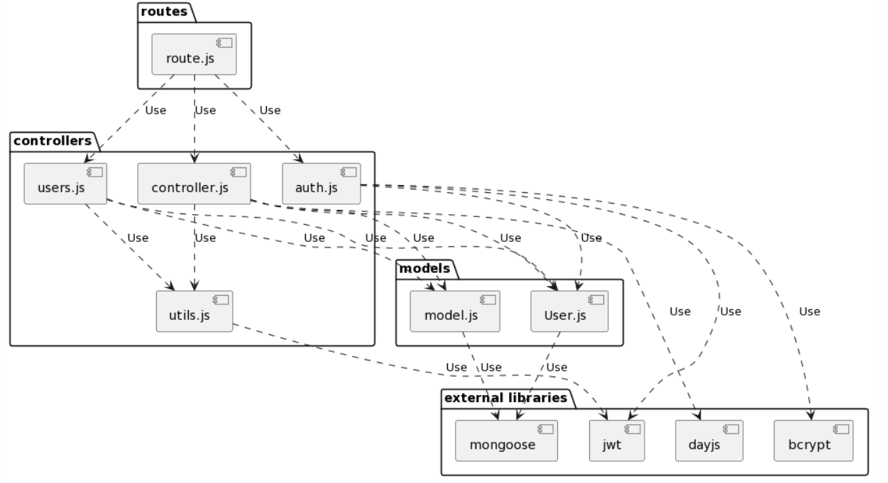
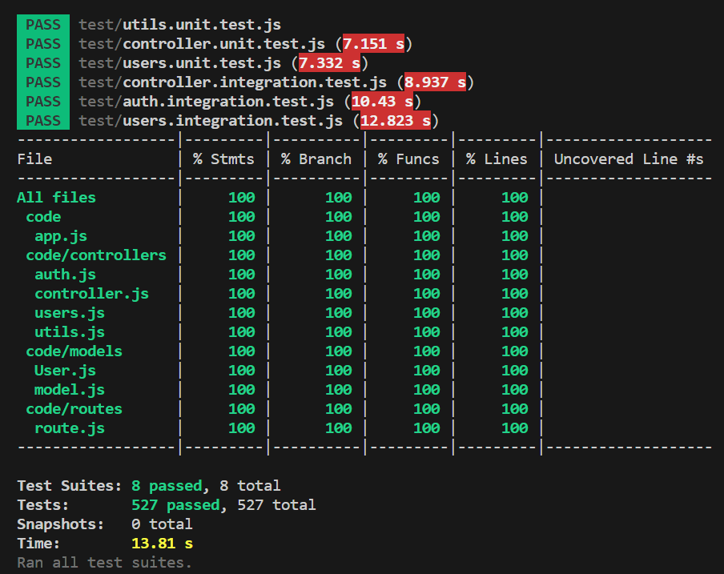

# Test Report
Date: 07/06/2023

Version: 1

# Contents

- [Dependency graph](#dependency-graph)

- [Integration approach](#integration-approach)

- [Tests](#tests)

- [Coverage](#Coverage)

# Dependency graph 
Due to the high dependency we used PlantUml to generate and visualize our dependency graph :

# Integration approach

    
The integration approach that our team adopted is a **bottom up** approach testing :
   - In the first step we have been tested Utils and auth by the means of unit testing and integration testing. The first have one dependecy, jwt library. Auth use User model and bcrypt library.
   - In the second step we have been tested Users and controller by unit testing. Both have dependency by model and User.
   - In the third step we have tested Utils, auth, users, and controller by integration testing.
## Step 1

| Test case name | Object(s) tested | Test level | Technique used |
|--|--|--|--|
|Utils|handleDateFilterParams verifyAuth handleAmountFilterParams|unit/integration|WB statement coverage/BB eq partitioning|
||
|auth|register registerAdmin login logout|unit/integration|WB statement coverage/BB eq partitioning|

## Step 2

| Test case name | Object(s) tested | Test level | Technique used |
|--|--|--|--|
|Users|getUsers getUser createGroup getGroups getGroup addToGroup removeFromGroup deleteUser deleteGroup|unit|WB / statement coverage|
||
|controller|createCategory updateCategory deleteCategory getCategories createTransaction getAllTransactions getTransactionsByUser getTransactionsByUserByCategory  getTransactionsByGroup getTransactionsByGroupByCategory deleteTransaction deleteTransactions  |unit|WB / statement coverage|

## Step 3
| Test case name | Object(s) tested | Test level | Technique used |
|--|--|--|--|
|Utils|handleDateFilterParams verifyAuth handleAmountFilterParams|integration|BB/ eq partitioning|
||
|auth|register registerAdmin login logout|integration|BB/ eq partitioning|
||
|Users|getUsers getUser createGroup getGroups getGroup addToGroup removeFromGroup deleteUser deleteGroup|integration|BB/ eq partitioning|
||
|controller|createCategory updateCategory deleteCategory getCategories createTransaction getAllTransactions getTransactionsByUser getTransactionsByUserByCategory  getTransactionsByGroup getTransactionsByGroupByCategory deleteTransaction deleteTransactions  |integration |BB/ eq partitioning| 

# Tests

 | Test case name | Object(s) tested | Test level | Technique used |
|--|--|--|--|
|<b>Register| | | |
|should register a new user and return success message | |unit |white box |
|should return a 400 error if request body is missing attributes |  |unit |white box |
|should return a 400 error if at least one parameter is an empty string |  |unit |white box |
|should return a 400 error if email is not in a valid format |  |unit |white box |
|should return a 400 error if username or email already exists| | unit |white box|
|should handle internal server errors and return 500 status| | unit |white box|
|Should create a new user and return 200 | |integration |black box |
|Should return an error if the email have invalid format | |integration |black box |
|Should return an error if at least one parameter is an empty string | |integration |black box |
|Should return an error for already registered user | |integration |black box |
||
|<b>RegisterAdmin | | | |
|should register a new admin user and return success message | |unit |white box |
|should return a 400 error if request body is missing attributes | |unit |white box |
|should return a 400 error if email is not in a valid format | |unit |white box |
|should return a 400 error if username or email already exists | |unit |white box |
|should handle internal server errors and return 500 status | |unit |white box |
|should register a new admin and return 200 | |integration |black box |
|should return an error if any required attributes is missing | |integration |black box |
|Should return an error if the email have invalid format | |integration |black box |
|Should return an error if at least one parameter is an empty string | |integration |black box |
|Should return an error for already registered user | |integration |black box |
||
|<b>Login | | | |
|Should return access and refresh tokens on successful login | |unit |white box |
|Should return an error if email is missing | |unit |white box |
|Should return an error if at least one of the parameters is an empty string | |unit |white box |
|Should return an error if the email is not in a valid format | |unit |white box |
|Should return an error if the email does not identify a user in the database | |unit |white box |
|Should return an error if the supplied password does not match with the one in the database | |unit |white box |
|Should return access and refresh tokens on successful login | |integration |black box |
|Should return an error if email is missing | |integration |black box |
|Should return an error if at least one of the parameters is an empty string | |integration |black box |
|Should return an error if the email is not in a valid format | |integration |black box |
|Should return an error if the email does not identify a user in the database | |integration |black box |
|Should return an error if the supplied password does not match with the one in the database | | integration| black box|
||
|<b>Logout | | | |
|Should return error 400 if request does not have a refresh token| |unit | white box|
|Should return error 400 if refresh token does not represent a user in the database ||unit | white box|
|Should logout ||unit | white box|
|should handle internal server errors and return 500 status ||unit | white box|
|Should logout a user ||integration | black box|
|Should return an error if refreshToken is not provided ||integration | black box|
|Should return an error if user is not found ||integration | black box|
||
|<b>createCategory | | | |
|should return 400 error if request body is missing attributes||unit|white box|
|should return 400 error if request body has empty attributes||unit|white box|
|should return 400 error if category type already exists||unit|white box|
|should return 401 error if called by non-admin user||unit|white box|
|should return a 500 error when an error occurs||unit|white box|
|should handle error when saving a new category||unit|white box|
|Returns a 400 error if request body is missing attributes | |integration | black box|
|Returns a 400 error if request body contains empty strings | |integration | black box|
|Returns a 400 error if category type already exists | |integration | black box|
|Returns a 401 error for non-admin users | |integration | black box|
||
|<b>updateCategory | | | |
|should return a 401 error if called by non-admin user | |unit | white box|
|should return a 400 error if category is not found | |unit | white box|
|should return a 400 error if request body is missing attributes | |unit | white box|
|should return a 400 error if updated category already exists | |unit | white box|
|should return a 500 error when an error occurs | |unit | white box|
|should update the category and transactions | |unit | white box|
|should update the category color | |unit | white box|
|Returns a message for confirmation and the number of updated transactions | |integration |black box |
|update just the color of the category | |integration |black box |
|Returns a 400 error if the type of the category does not represent any ctagory in the database | |integration |black box |
|Returns a 400 error if the type of the new category is the same as one that exists already and that category is not the requested one | |integration |black box |
|Returns a 400 error if the request body does not contain all the necessary parameters | |integration |black box |
|Returns a 401 error if called by a user who is not an Admin | |integration |black box |
||
|<b>deleteCategory | | | |
|should return a 401 error if called by a non-admin user | |unit |white box|
|should return a 400 error if the request body does not contain all the necessary attributes | |unit |white box|
|should return a 400 error if there is only one category in the database | |unit |white box|
|should return a 400 error if at least one of the types in the array is an empty string | |unit |white box|
|should return a 400 error if at least one of the types in the array does not represent a category in the database | |unit |white box|
|should return a 500 error when an error occurs | |unit |white box|
|should delete the categories and update the affected transactions | |unit |white box|
|should delete all the categories, except the oldest, and update the affected transactions | |unit |white box|
|Returns a 400 error if the request body does not contain all the necessary attributes | |integration |black box|
|Returns a 400 error if there is only one category in the database | |integration |black box|
|Returns a 400 error if the array passed in the request body is empty | |integration |black box|
|Returns a 400 error if at least one of the types in the array does not represent a category in the database | |integration |black box|
|Deletes categories and updates transactions correctly | |integration |black box|
|Try to delete all categories and updates transactions correctly | |integration |black box|
||
|<b>getCategories | | | |
|should return an array of objects when authenticated with Simple auth | |unit| white box|
|should return an empty array of objects | |unit| white box|
|should return a 401 error when not authenticated with Simple auth | |unit| white box|
|should return a 500 error when an error occurs | |unit| white box|
|Returns a 401 error if called by a user who is not authenticated | |integration| white box|
|Returns an array of category objects if called by an authenticated user | |integration| white box|
|Returns an empty array if there are no categories | |integration| white box|
||
|<b>createTransaction | | | |
|should create a new transaction and return the transaction data | | unit | white box|
|should return a 400 error if the request body does not contain all the necessary attributes | | unit | white box|
|should return a 400 error if at least one of the parameters in the request body is an empty string | | unit | white box|
|should return a 400 error if the type of category passed in the request body does not exist | | unit | white box|
|should return a 400 error if the username passed in the request body is not equal to the one passed as a route parameter | | unit | white box|
|should return a 400 error if the username passed in the request body does not represent a user in the database | | unit | white box|
|should return a 400 error if the amount passed in the request body cannot be parsed as a floating value | | unit | white box|
|should return a 400 error if the user\'s refreshToken in the request cookie is not valid | |unit | white box|
|should return a 401 error if not authorized | |unit | white box|
|should return a 500 error is internal server error happens | |unit | white box|
|Returns a 401 error if called by an authenticated user who is not the same user as the one in the route parameter | | integration | black box|
|Returns a 400 error if the request body does not contain all the necessary attributes | | integration | black box|
|Returns a 400 error if at least one of the parameters in the request body is an empty string | | integration | black box|
|Returns a 400 error if the type of category passed in the request body does not represent a category in the database | | integration | black box|
|Returns a 400 error if the username passed in the request body is not equal to the one passed as a route parameter | | integration | black box|
|Returns a 400 error if the username passed in the request body does not represent a user in the database | | integration | black box|
|Returns a 400 error if token not valid | | integration| black box|
|Returns a 400 error if the amount passed in the request body cannot be parsed as a floating value | | integration| black box|
|Returns a 200 status and the transaction object if all conditions are met | | integration| black box|
||
|<b>getAllTransactions | | | |
|should return all transactions made by all users | | unit| white box|
|should return error 401 if not authorized | | unit| white box|
|should return error 500 if Internal Server Error happens | | unit| white box|
|should return all transactions made by all users | |integration| black box|
|should return error 401 if not authorized | |integration| black box|
|should return error 500 if Internal Server Error happens | |integration| black box|
|<b>getTransactionsByUser | | | |
|Only username parameter requested by admin | |unit | white box|
|Only username parameter requested by user | |unit | white box|
|Only with date | |unit | white box|
|Only with amount| |unit | white box|
|Admin not authorized and should return 401| | unit | white box|
|Admin request with user not found, error 400 | | unit | white box|
|User not authorized and should return 401 | | unit | white box|
|User request with user not found, error 400 | | unit | white box|
|Request by admin, only username parameter | | integration | black box|
|Requested by user with date, min and max | | integration | black box|
|Request by user with from and upTo, min and max | | integration | black box|
|Request by user with date, min and max but there aren't transactions in that date | | integration | black box|
|Request by user without date, min and max | | integration | black box|
|Admin not authorized and should return 401 | | integration | black box|
|Admin request with user not found, error 400 | | integration | black box|
|User not authorized and should return 401 | | integration | black box|
|User request with user not found, error 400 | | integration | black box|
||
|<b>getTransactionsByUserByCategory | | | |
|User correct request | |unit | white box|
|Admin correct request | |unit | white box|
|Admin not authorized, error 401 | |unit | white box|
|User not authorized, error 401 | |unit | white box|
|User doesn't exist with admin authentication, error 400 | |unit | white box|
|Category doesn't exist with admin authentication, error 400 | |unit | white box|
|Category doesn't exist with user authentication, error 400 | |unit | white box|
|Error 500 | |unit | white box|
|User correct request | |integration | black box|
|Admin correct request | |integration | black box|
|Admin not authorized, error 401 | |integration | black box|
|User not authorized, error 401 | |integration | black box|
|Admin request and user doesn't exist, error 400 | |integration | black box|
|Admin request and category doesn't exist, error 400 | |integration | black box|
|User request and category doesn't exist, error 400 | |integration | black box|
||
|<b>getTransactionsByGroup | | | |
|admin success | |unit | white box|
|user success | |unit | white box|
|unauthorized user route | |unit | white box|
|unauthorized admin route | |unit | white box|
|group does not exist | |unit | white box|
|fail due to a db error | |unit | white box|
|success on user | |integration | black box|
|admin uses user root and fails | |integration | black box|
|admin uses user root and have success | |integration | black box|
|success on admin | |integration | black box|
|user uses admin root and fails | |integration | black box|
|group does not exist | |integration | black box|
||
|<b>getTransactionsByGroupByCategory | | | |
|admin success | |unit | white box|
|user success | |unit | white box|
|unauthorized user route | |unit | white box|
|unauthorized admin route | |unit | white box|
|group does not exist | |unit | white box|
|category does not exist | |unit | white box|
|fail due to a db error | |unit | white box|
|success on user | |integration | black box|
|admin uses user root and fails | |integration | black box|
|admin uses user root and have success | |integration | black box|
|success on admin | |integration | black box|
|user uses admin root and fails | |integration | black box|
|group does not exist | |integration | black box|
|category does not exist | |integration | black box|
||
|<b>deleteTransaction | | | |
|should delete a transaction and return a success message | |unit | white box|
|should return a 400 error if the username passed as a route parameter does not represent a user in the database | |unit | white box|
|should return a 400 error if the _id in the request body does not represent a transaction in the database | |unit | white box|
|should return a 400 error if the _id in the request body represents a transaction made by a different user than the one in the route | |unit | white box|
|should return a 401 error if called by an authenticated user who is not the same user as the one in the route | |unit | white box|
|should return a 500 error if Internal Server Error happens | |unit | white box|
|Should delete a transaction and return a success message | |integration | black box|
|should return an error if user or transaction does not exist | |integration | black box|
|Should return an error if user tries to delete an invalid transaction | |integration | black box|
|Should return an error if the user is not authorized | |integration | black box|
||
|<b>deleteTransactions | | | |
|should delete transactions and return a success message| |unit | white box|
|should return a 400 error if the request body does not contain all the necessary attributes | |unit | white box|
|should return a 400 error if at least one of the ids in the array is an empty string | |unit | white box|
|should return a 400 error if at least one of the ids in the array does not represent a transaction in the database | |unit | white box|
|should return a 401 error if called by an authenticated user who is not an admin | |unit | white box|
|should return a 500 error if Internal Server Error happens | |unit | white box|
|Should delete transactions and return success message | |integration | black box|
|Should return a 400 error if the request body does not contain all the necessary attributes | |integration | black box|
|Should return a 400 error if at least one of the ids in the array is an empty string | |integration | black box|
|should return a 400 error if at least one of the ids in the array does not represent a transaction in the database | |integration | black box|
|Should return a 401 error if called by an authenticated user who is not an admin | |integration | black box|
||
|<b>getUsers | | | |
|should return empty list if there are no users | |unit | white box|
|should retrieve list of all users | |unit | white box|
|should return error with invalid authentication | |unit | white box|
|should handle other errors and return 500 response | |unit | white box|
|Should return all users when admin authentication is successful | |integration | black box|
|Should return 401 is not an admin | |integration | black box|
||
|<b>getUser | | | |
|should retrieve user details with user authentication | |unit | white box|
|should return error with invalid authentication | |unit | white box|
|should retrieve user details with admin authentication | |unit | white box|
|should return a 400 error when user is not found with admin authentication | |unit | white box|
|should handle error and return 500 response | |unit | white box|
|Should return user data when authenticated as user | |integration | black box|
|Should return user data when authenticated as admin | |integration | black box|
|Should return a 400 error if user does not exist - (verifyAuth=Admin) | |integration | black box|
|Should return a 401 error if user is neither the same user one the route parameter nor an admin | |integration | black box|
||
|<b>createGroup | | | |
|user creates a group | |unit | white box|
|user creates a group and he does not have his email in the list | |unit | white box|
|request body does not contain all the necessary attributes (missing memberEmails) | |unit | white box|
|request body does not contain all the necessary attributes (missing name) | |unit | white box|
|request body does not contain all the necessary attributes (missing body) | |unit | white box|
|empty string as name | |unit | white box|
|user creates a group with only himself, specifying his email and other 2 non existing emails in the body
|all the provided emails represent users that do not exist |unit | white box|
|all the provided emails represent users belong to another group | |unit | white box|
|user unauthorized | |unit | white box|
|existing group name | |unit | white box|
|user who creates the group is already in another group | |unit | white box|
|empty emails | |unit | white box|
|not valid emails | |unit | white box|
|group creation fails due to a db error | |unit | white box|
|user creates a group | |integration | black box|
|admin success on creation | |integration | black box|
|user success with someone already in group | |integration | black box|
|user success with a non existing member | |integration | black box|
|request body empty | |integration | black box|
|request body does not contain the memberEmails | |integration | black box|
|request body does not contain the name | |integration | black box|
|empty string as name | |integration | black box|
|user creates a group and he does not have his email in the list | |integration | black box|
|user creates a group with only himself, specifying his email and other not existing emails | |integration | black box|
|all the provided emails represent users that do not exist | |integration | black box|
|all the provided emails belong to another group | |integration | black box|
|group already exists | |integration | black box|
|user unauthorized | |integration | black box|
|user who creates the group is already in another group | |integration | black box|
|empty emails | |integration | black box|
|not valid emails | |integration | black box|
||
|<b>getGroups | | | |
|authenticated admin requests all the groups|
|unathorized user requests all the groups | |unit |white box|
|authenticated admin fails request due to a db error | |unit |white box|
|authenticated admin requests all the groups | |integration| black box|
|unauthorized | |integration| black box|
||
|<b>getGroup | | | |
|success on user (user in the group) | white box|
|fail on user (user not authorized) | |unit | white box|
|group does not exist | |unit | white box|
|success on admin | |unit | white box|
|authentication fail | |unit | white box|
|fail due to a db error | |unit | white box|
|authenticated user requests info about his group | |integration | black box|
|unauthorized | |integration | black box|
|user requests info about a group that it is not his group | |integration | black box|
|authenticated admin requests info about a group | |integration | black box|
|group does not exist | |integration | black box|
||
|<b>addToGroup | | | |
|successful add by admin | |unit |white box|
|successful add by user | |unit |white box|
|missing request body attributes | |unit |white box|
|group does not exist | |unit |white box|
|all emails already in a group | |unit |white box|
|all emails do not exist | |unit |white box|
|invalid email format | |unit |white box|
|empty email | |unit |white box|
|unauthorized user (Group authType) | |unit |white box|
|unauthorized user (Admin authType) | |unit |white box|
|fail due to a db error | |unit |white box|
|successful add by user | |integration |black box|
|unauthorized add by user because not an admin (invalid path) | |integration |black box|
|successful add by admin in a group | |integration |black box|
|admin uses user path to add someone in his group | |integration |black box|
|admin uses user path to add someone in a differernt group | |integration |black box|
|missing request body attributes | |integration |black box|
|group does not exist | |integration |black box|
|all emails already in a group | |integration |black box|
|all emails do not exist | |integration |black box|
|invalid email format | |integration |black box|
|empty email | |integration |black box|
||
|<b>removeFromGroup | | | |
|successful remove by admin | |unit | white box|
|successful remove by user | |unit | white box|
|error remove by admin unauthorized root | |unit | white box|
|error remove by user unauthorized root | |unit | white box|
|error if request body does not contain necessary attributes | |unit | white box|
|group does not exist | |unit | white box|
|fail due to a db error | |unit | white box|
|all emails do not belong to the group | |unit | white box|
|all emails do not exist in the DB | |unit | white box|
|all emails do not belong to the group or do not exist in the DB | |unit | white box|
|invalid email format | |unit | white box|
|empty email | |unit | white box|
|group composed by only one member | |unit | white box|
|successful remove by user leaving one member | |unit | white box|
|successful remove by user | |integration | block box|
|successful remove by admin | |integration | block box|
|successful remove by admin | |integration | block box|
|user root allows admin to remove a component in his group | |integration | block box|
|user root does not allow user to remove a component in another group | |integration | block box|
|admin root does not allow user to remove a component in another group | |integration | block box|
|unauthorized | |integration | block box|
|group does not exist | |integration | block box|
|all emails do not exist or are not in the group | |integration | block box|
|invalid email format | |integration | block box|
|empty email | |integration | block box|
|not correct body | |integration | block box|
|group composed by only one member | |integration | block box|
|successful remove by user leaving one member | |integration | block box|
||
|<b>deleteUser | | | |
|should delete the user and return the result if autorized | |unit |white box|
|should delete the user and return the result if not in a group | |unit |white box|
|should delete the user and the group if user is the last member | |unit |white box|
|should return a 400 error if user email does not exist | |unit |white box|
|should return a 400 error if user to be deleted is an Admin | |unit |white box|
|should return a 400 error if request body is missing email | |unit |white box|
|should return a 400 error if email in request body is an empty string | |unit |white box|
|should return a 400 error if email in request body is not in correct format | |unit |white box|
|should return a 401 error if not authorized | |unit |white box|
|should return a 500 error if an error occurs | |unit |white box|
|Should delete a user and return the deleted transaction count and group deletion status | |integration |black box|
|Should delete a user and return the deleted transaction count and group deletion status | |integration |black box|
|Should delete a user and return the deleted transaction count and group deletion status | |integration |black box|
|Should return an error if the user to delete is an admin | |integration |black box|
|Should delete a user and the group if they are the last member | |integration |black box|
|Should return a 400 error if the request body does not contain all the necessary attributes | |integration |black box|
|Should return a 400 error if the email passed in the request body is an empty string | |integration |black box|
|Should return a 400 error if the email passed in the request body is not in correct email format | |integration |black box|
|Should return a 400 error if the email passed in the request body does not represent a user in the database | |integration |black box|
|Should return a 400 error if the email passed in the request body represents an admin | |integration |black box|
|Should return a 401 error if called by an authenticated user who is not an admin | |integration |black box|
||
|<b>deleteGroup | | | |
|succesful delete by admin | |unit | white box|
|unauthorized | |unit | white box|
|empty body | |unit | white box|
|name passed is an empty string | |unit | white box|
|group does not exist | |unit | white box|
|fail due to a db error | |unit | white box|
|successful delete by admin | |integration | black box|
|unauthorized | |integration | black box|
|group does not exist | |integration | black box|
|empty body | |integration | black box|
|name is an empty string | |integration | black box|
||
|<b>verifyAuth | | | |
|Undefined tokens | |unit | white box|
|Access token is missing information (AuthType=Simple) | |unit | white box|
|Refresh token is missing information (AuthType=Simple) | |unit | white box|
|Tokens are both valid but with different values (AuthType=Simple) | |unit | white box|
|Tokens are both valid and belong to the requested user (AuthType=Simple) | |unit | white box|
|Access token is missing informations (AuthType=User) | |unit | white box|
|Refresh token is missing informations (AuthType=User) | |unit | white box|
|Tokens are both valid but with different values (AuthType=User) | |unit | white box|
|Tokens are both valid but not belonging to the requested user (AuthType=User) | |unit | white box|
|Tokens are both valid and belong to the requested user (AuthType=User) | |unit | white box|
|Access token is missing informations (AuthType=Admin) | |unit | white box|
|Refresh token is missing informations (AuthType=Admin) | |unit | white box|
|Tokens are both valid but with different values (AuthType=Admin) | |unit | white box|
|Tokens are both valid but not belonging to the requested user (AuthType=Admin) | |unit | white box|
|Tokens are both valid and belong to the requested user (AuthType=Admin) | |unit | white box|
|Access token is missing informations (AuthType=Group) | |unit | white box|
|Refresh token is missing informations (AuthType=Group) | |unit | white box|
|Tokens are both valid but with different values (AuthType=Group) | |unit | white box|
|Tokens are both valid but not belonging to the requested user (AuthType=Group) | |unit | white box|
|Tokens are both valid and belong to the requested user (AuthType=Group) | |unit | white box|
|Access token expired and refresh token is missing informations (AuthType=Simple) | |unit | white box|
|Access token expired and refresh token valid (AuthType=Simple) | |unit | white box|
|Access token expired and refresh token is missing information (AuthType=User) | |unit | white box|
|Access token expired not recreated and refresh token not belonging to the requested user (AuthType=User) | |unit | white box|
|Access token expired and refresh token belonging to the requested user (AuthType=User) | |unit | white box|
|Access token expired and refresh token is missing information (AuthType=Admin) | |unit | white box|
|Access token expired and refresh token not belonging to the requested user (AuthType=Admin) | |unit | white box|
|Access token expired and refresh token belonging to the requested user (AuthType=Admin) | |unit | white box|
|Access token expired and refresh token is missing information (AuthType=Group) | |unit | white box|
|Access token expired and refresh token belonging to the requested user (AuthType=Group) | |unit | white box|
|Access token expired and refresh token belonging to the requested user (AuthType=Group) | |unit | white box|
|Access token and refresh token are both invalid | |unit | white box|
|Undefined tokens | |integration | black box|
|Access token is missing information (AuthType=Simple) | |integration | black box|
|Refresh token is missing information (AuthType=Simple) | |integration | black box|
|Tokens are both valid but with different values (AuthType=Simple) | |integration | black box|
|Tokens are both valid and belong to the requested user (AuthType = Simple) | |integration | black box|
|Access token is missing information (AuthType=User) | |integration | black box|
|Refresh token is missing information (AuthType=User) | |integration | black box|
|Tokens are both valid but with different values (AuthType=User) | |integration | black box|
|Tokens are both valid but not belonging to the requested user (AuthType=User) | |integration | black box|
|Tokens are both valid and belong to the requested user - AuthType = User | |integration | black box|
|Access token is missing information (AuthType=Admin) | |integration | black box|
|Refresh token is missing information (AuthType=Admin) | |integration | black box|
|Tokens are both valid but with different values (AuthType=Admin) | |integration | black box|
|Tokens are both valid but not belonging to the requested user (AuthType=Admin) | |integration | black box|
|Tokens are both valid and belong to the requested user - AuthType = Admin | |integration | black box|
|Access token is missing information (AuthType=Group) | |integration | black box|
|Refresh token is missing information (AuthType=Group) | |integration | black box|
|Tokens are both valid but with different values (AuthType=Group) | |integration | black box|
|Tokens are both valid but not belonging to the requested user (AuthType=Group) | |integration | black box|
|Tokens are both valid and belong to the requested user - AuthType = Group | |integration | black box|
|Access token expired and refresh token is missing information (AuthType=Simple) | |integration | black box|
|Access token expired and refresh token valid (AuthType=Simple) | |integration | black box|
|Access token expired and refresh token is missing information (AuthType=User) | |integration | black box|
|Access token expired and refresh token with wrong username (AuthType=User) | |integration | black box|
|Access token expired and refresh token valid (AuthType=User) | |integration | black box|
|Access token expired and refresh token is missing information (AuthType=Admin) | |integration | black box|
|Access token expired and refresh token with wrong role (AuthType=Admin) | |integration | black box|
|Access token expired and refresh token valid (AuthType=Admin) | |integration | black box|
|Access token expired and refresh token is missing information (AuthType=Group) | |integration | black box|
|Access token expired and refresh token not belong to the group (AuthType=Group) | |integration | black box|
|Access token expired and refresh token valid (AuthType=Group) | |integration | black box|
|Access token expired and refresh token belonging to the requested user -AuthType = User | |integration | black box|
||
|<b>handleDateFilterParams - Date tests  | | | |
|correct parameter | |unit | white box|
|wrong year A023-05-21 | |unit |white box|
|wrong year 20230-05-21 | |unit |white box|
|wrong month 2023-0D-21 | |unit |white box|
|wrong month 2023-13-21 | |unit |white box|
|wrong day 2023-05-A0 | |unit |white box|
|wrong day 2023-05-35 | |unit |white box|
|wrong format 12-05-2023 | |unit |white box|
|wrong format 2023/05/12 | |unit |white box|
|wrong format 2023\\05\\12 | |unit |white box|
|correct parameter | |integration |black box|
|wrong year A023-05-21 | |integration |black box|
|wrong year 20230-05-21 | |integration |black box|
|wrong month 2023-0D-21 | |integration |black box|
|wrong month 2023-13-21 | |integration |black box|
|wrong day 2023-05-A0 | |integration |black box|
|wrong day 2023-05-35 | |integration |black box|
|wrong format 12-05-2023 | |integration |black box|
|wrong format 2023/05/12 | |integration |black box|
|wrong format 2023\\05\\12 | |integration |black box|
||
|<b>handleDateFilterParams - From tests  | | | |
|correct parameter | |unit | white box|
|wrong year A023-05-21 | |unit |white box|
|wrong year 20230-05-21 | |unit |white box|
|wrong month 2023-0D-21 | |unit |white box|
|wrong month 2023-13-21 | |unit |white box|
|wrong day 2023-05-A0 | |unit |white box|
|wrong day 2023-05-35 | |unit |white box|
|wrong format 12-05-2023 | |unit |white box|
|wrong format 2023/05/12 | |unit |white box|
|wrong format 2023\\05\\12 | |unit |white box|
|correct parameter | |integration |black box|
|wrong year A023-05-21 | |integration |black box|
|wrong year 20230-05-21 | |integration |black box|
|wrong month 2023-0D-21 | |integration |black box|
|wrong month 2023-13-21 | |integration |black box|
|wrong day 2023-05-A0 | |integration |black box|
|wrong day 2023-05-35 | |integration |black box|
|wrong format 12-05-2023 | |integration |black box|
|wrong format 2023/05/12 | |integration |black box|
|wrong format 2023\\05\\12 | |integration |black box|
||
|<b>handleDateFilterParams - upTo tests  | | | |
|correct parameter | |unit | white box|
|wrong year A023-05-21 | |unit |white box|
|wrong year 20230-05-21 | |unit |white box|
|wrong month 2023-0D-21 | |unit |white box|
|wrong month 2023-13-21 | |unit |white box|
|wrong day 2023-05-A0 | |unit |white box|
|wrong day 2023-05-35 | |unit |white box|
|wrong format 12-05-2023 | |unit |white box|
|wrong format 2023/05/12 | |unit |white box|
|wrong format 2023\\05\\12 | |unit |white box|
|correct parameter | |integration |black box|
|wrong year A023-05-21 | |integration |black box|
|wrong year 20230-05-21 | |integration |black box|
|wrong month 2023-0D-21 | |integration |black box|
|wrong month 2023-13-21 | |integration |black box|
|wrong day 2023-05-A0 | |integration |black box|
|wrong day 2023-05-35 | |integration |black box|
|wrong format 12-05-2023 | |integration |black box|
|wrong format 2023/05/12 | |integration |black box|
|wrong format 2023\\05\\12 | |integration |black box|
||
|<b>handleDateFilterParams - Date and upTo or from test  | | | |
|date and upTo | |unit | white box|
|date and from | |unit | white box|
|date and upTo | |integration | black box|
|date and from | |integration | black box|
||
|<b>handleDateFilterParams - from and upTo  | | | |
|both parameter | |unit |white box|
|from correct and upTo wrong | |unit |white box|
|from wrong and upTo correct | |unit |white box|
|from wrong and upTo wrong | |unit |white box|
|both parameter | |integration |black box|
|from correct and upTo wrong | |integration |black box|
|from wrong and upTo correct | |integration |black box|
|from wrong and upTo wrong | |integration |black box|
||
|<b>handleAmountFilterParams - Test about only min combination  | | | |
|only min return query | |unit | white box|
|only min with a space | |unit | white box|
|only min with a character | |unit | white box|
|only min with a number as char | |unit | white box|
|only min return query | |integration | black box|
|only min with a space | |integration | black box|
|only min with a character | |integration | black box|
|only min with a number as char | |integration | black box|
||
|<b>handleAmountFilterParams - Test only max combination  | | | |
|only max return query | |unit | white box|
|only max with a space | |unit | white box|
|only max with a character | |unit | white box|
|only max return query | |integration | black box|
|only max with a space | |integration | black box|
|only max with a character | |integration | black box|
||
|<b>handleAmountFilterParams - Test with min and max parameter  | | | |
|nothing parameter is passed | |unit |white box|
|min and max return query | |unit |white box|
|with min and max with char | |unit |white box|
|nothing parameter is passed | |integration| black box|
|min and max return query | |integration| black box|
|with min and max with char | |integration| black box|

# Coverage

## Coverage of FR

The following table is the coverage of the official functional requirements as well as the name of Tests corresponding to them.
You can find the functions in  the following folder:
code/controllers/test

| Functional Requirements covered |   Test(s) | 
| ------------------------------- | ----------- | 
| FR11                            |<ul> <li>register</li></ul>|             
| FR12                            |<ul> <li>login</li></ul>   | 
| FR13                            |<ul> <li>logout</li></ul>  |
| FR14                            |<ul> <li>registerAdmin</li></ul>  |
| FR15                            |<ul> <li>getUsers</li></ul>  |
| FR16                            |<ul> <li>getuser</li></ul>|             
| FR17                            |<ul> <li>deleteUser</li></ul>   |
|  |
| FR21                            |<ul> <li>createGroup</li></ul>  |
| FR22                            |<ul> <li>getGroups</li></ul>  |
| FR23                            |<ul> <li>getGroup</li></ul>  |
| FR24                            |<ul> <li>addToGroup</li></ul>  |
| FR26                            |<ul> <li>removeFromGroup</li></ul>  |
| FR28                            |<ul> <li>deleteGroup</li></ul>  |
||
| FR31                            |<ul> <li>createTransaction</li></ul>  |
| FR32                            |<ul> <li>getAllTransactions</li></ul>  |
| FR33                            |<ul> <li>getTransactionByUser</li></ul>  |
| FR34                            |<ul> <li>getTransactionByUserByCategory</li></ul>  |
| FR35                            |<ul> <li>getTransactionsByGroup</li></ul>  |
| FR36                            |<ul> <li>getTransactionsByGroupByCategory</li></ul>  |
| FR37                            |<ul> <li>deleteTransaction</li></ul>  |
| FR38                            |<ul> <li>deleteTransactions</li></ul>  |
||
| FR41                            |<ul> <li>createCategory</li></ul>  |
| FR42                            |<ul> <li>updateCategory</li></ul>  |
| FR43                            |<ul> <li>deleteCategory</li></ul>  |
| FR44                            |<ul> <li>getCategories</li></ul>  |

## Coverage white box

